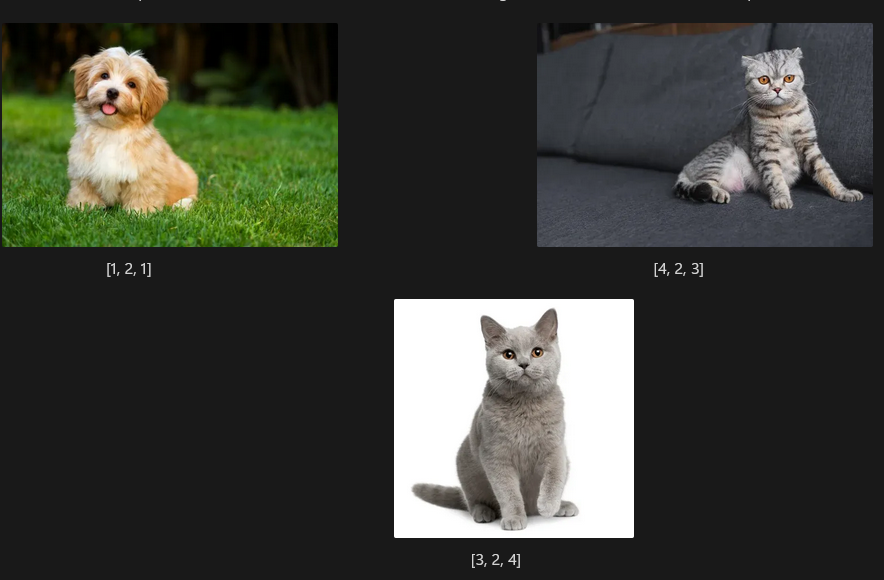
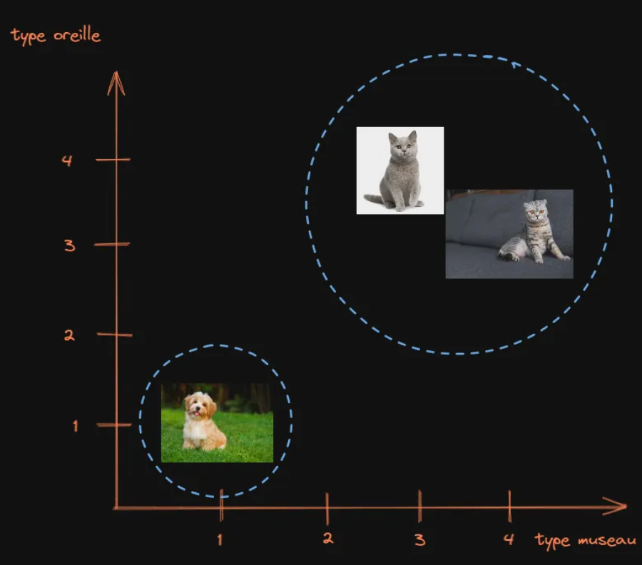

# Import des images et similarité

Tous les outils de similarité de panoptic se reposent sur une première étape ayant lieu lors de l'import des images: **la vectorisation.**

Ce processus consiste à utiliser un modèle de Deep Learning, en l'occurence [le modèle open source OpenAI - CLIP](https://huggingface.co/openai/clip-vit-base-patch32) pour transformer les images en **embedding** (ou plongement en français). 

Ces embeddings vont permettre de comparer facilement les images entre elles, non seulement en fonction de leur ressemblance visuelle, mais également en fonction de ce qu'elles représentent. 

## Exemple illustré

Concrètement les embeddings sont des listes de chiffres, le nombre de chiffres pourra varier en fonction du modèle utilisé mais par exemple pour CLIP les images sont transformés en listes de 512 chiffres. Ces derniers représentent des caractéristiques visuelles et / ou sémantiques des images, mais sont durs à interpréter si l'on regarder uniquement les chiffres.

Voici un exemple fictif et extrêmement simplifié d'embeddings de seulement 3 chiffres que l'on pourrait obtenir pour les images suivantes:

Les deux vecteurs de chats sont a priori plus proches en valeur. On pourrait alors chercher à interprêter ce que représente chaque valeur pour le modèle, (par exemple le type de museau, la posture, le type d’oreille), mais c’est un champ de recherche à part, et ici nous nous contentons d’utiliser le modèle en partant du principe qu’il a été préalablement bien entrainé et saura convertir nos images en vecteurs de telle sorte qu’il puisse bien identifier les images.

Une fois que le modèle a transformé nos images en vecteurs, on peut se permettre de créer des groupes d’images en fonction de ces caractéristiques (qui ne sont, rappelons le, pas des caractéristiques purement visuelles comme on a pu le voir dans les premières méthodes, mais bien des caractéristiques de ce qui est représenté.) 

Ces groupes peuvent être représentés sur un graphique, ce qui implique toutefois de ne garder que deux points par image. Il existe [des méthodes statistiques permettant de calculer ces deux points et ce quel que soit la taille du vecteur d’entrée](https://fr.wikipedia.org/wiki/Analyse_en_composantes_principales) mais ici par souci de simplicité nous nous contenterons de ne conserver que les points correspondant aux museaux et aux oreilles puisqu’ils sont a priori les plus significatifs.

On obtient donc le graphique suivant:

Ce qui nous permet de constater qu’effectivement on peut visuellement regrouper nos images en groupes, les chats ensemble et le chien à part.

