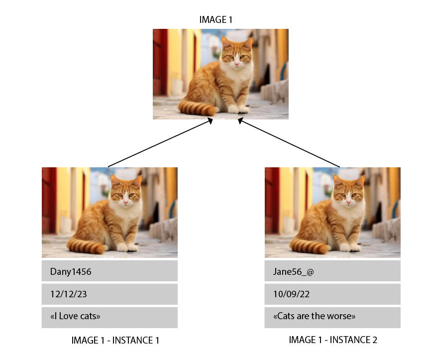

# Instances

L’un des concepts les plus complexes à comprendre dans Panoptic est la différence entre images et instances. Pour comprendre la nécessité de cette distinction, prenons l’exemple d’une image trouvée sur Twitter, mais postée par deux utilisateurs différents, à des moments différents, et avec des messages très distincts. Techniquement, c’est la même image, mais comme les contextes dans lesquels elle apparaît sont très différents, on pourrait considérer qu'elle n'est pas sémantiquement identique.

Ainsi, si nous souhaitons observer les images dans Panoptic avec leurs contextes stockés sous forme de propriétés, une même image peut apparaître plusieurs fois si elle a été trouvée plusieurs fois dans le corpus avec des propriétés différentes.

!!! tip "En résumé"

    Une image correspond uniquement à un ensemble de pixels.

    Une instance d'image représente l'occurrence de cet ensemble de pixels dans un contexte spécifique.

Par conséquent, une image peut avoir plusieurs instances, mais une instance ne peut être liée qu'à une seule image.

## Propriétés d'instances

Du fait de la différence que nous venons d'observer, il existe deux types d'annotations que l'on va pouvoir produire dans panoptic:

- Les annotations servant à décrire **toutes** les instances d'une même image, dans l'exemple ci dessus, cela serait d'annoter l'image en disant que c'est un chat, pour cela on utilise donc les **propriétés d'images** qui vont automatiquement être appliquées à toutes les instances.
- Les annotations servant à décrire **une instance en particulier**, dans l'exemple ci dessus, cela serait d'annoter en disant que l'instance 1 est "pro-chats" alors que l'instance 2 est "anti-chats". On utilise pour cela des **propriétés d'instances**. 