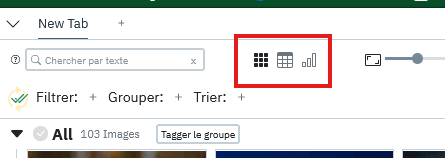
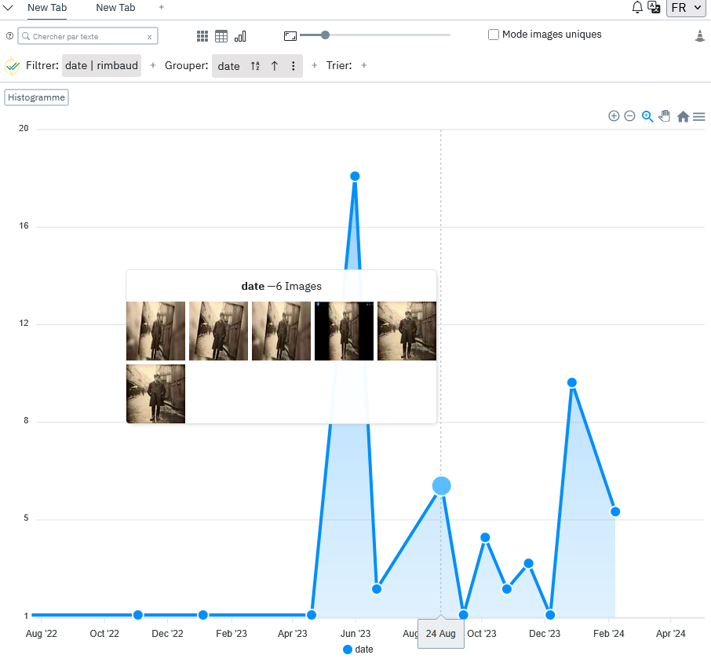
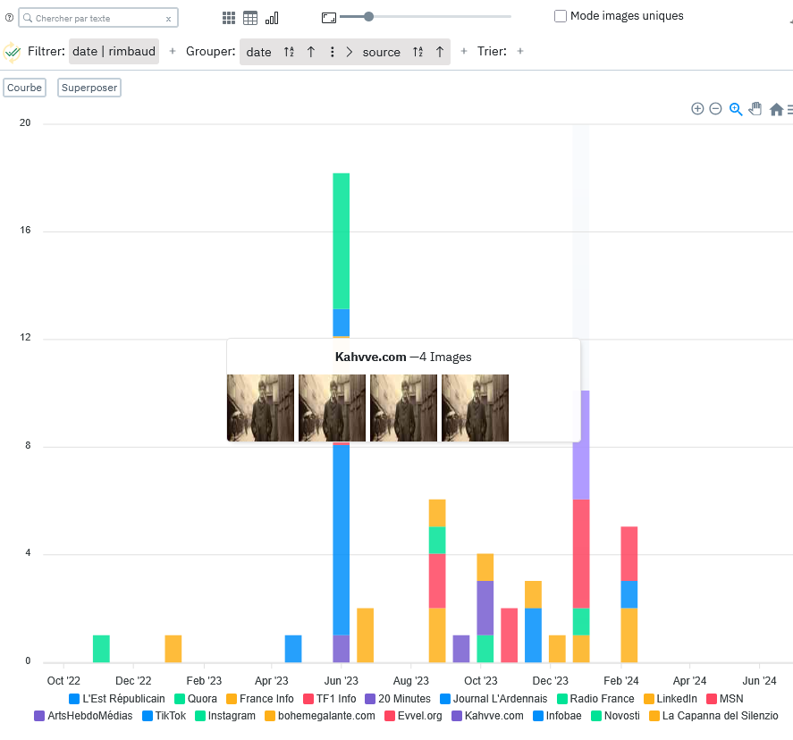

# Les onglets 

Comme abordé brièvement précédemment, panoptic propose un système d'onglets permettant de conserver différents points de vue en parallèle sur le même corpus. 

## Exemple de cas d'usage

L'objectif est de pouvoir créer des espace de travail dédiés à certains objets à l'aide des filtres des tris et des groupes. Un exemple basique est l'utilisation d'un onglet "poubelle". On utilise un premier onglet d'exploration, dans lequel on annote les images avec une propriété de type checkbox "hors corpus" tout en appliquant un filtre sur cette propriété. Toutes les images qui sont cochées disparaissent alors instantanément du premier onglet grâce à ce filtre et aparaissent dans un autre onglet qui a le filtre inverse (c'est à dire ne laissant apparaître que les images qui ont la case "hors corpus" de cochée). Cela permet de revenir de temps en temps se concentrer sur l'onglet "poubelle" afin de revisionner les images qui ont été désignées comme hors corpus et de vérifier que l'on a pas fait d'erreur, sans pour autant devoir voir ces images là dans la vue principale.

## Les vues

Si chaque onglet peut avoir ses propres filtres, tris et groupes, il est également possible de configurer l'affichage désiré au niveau de l'onglet en choisissant la [vue](/concepts/#vues). 

### La vue grille
La vue par défaut, affiche une simple grille d'images.

### La vue tableau

Une vue sous forme de tableau classique, elle permet de se concentrer plus sur les propriétés accompagnant les images, notamment les propriétés de type texte pouvant prendre de la place.

### La vue graphe

Vue pour l'instant encore un peu expérimentale mais permettant d'afficher des graphiques montrant le nombre d'image contenues dans un groupage. 
Exemple, si je groupe mes images par date et passe en vue graphe, je peux afficher le nombre d'images à chaque date, ainsi qu'une prévisualisation des images à cette date en survolant un point: 

!!! note

    Il est à noter que tous les filtres et tris sont également appliqués en temps réel dans cette vue, ce qui vous permet de modifier votre graphique à la volée en fonction d'autres propriétés que vous auriez. Dans l'exemple ci dessus on n'affiche que le graphique entre certaines dates, et seules les images ayant été taggées comme "rimbaud".
    De même le groupage par date permet de changer la granularité du groupage en choisissant à la minute, heure, jour, semaine, mois, année. Ces changements sont également répercutés sur le graphe.

Il est également possible de rajouter un nouveau de groupage permettant de fractionner le graphique en fonction d'une autre propriété, ici par exemple on rajoute un groupage après la date pour grouper ensuite par type de source d'où proviennent les images à chaque date. (On a également passé le type de graphique à histogramme en cliquant sur le bouton "Histogramme").

