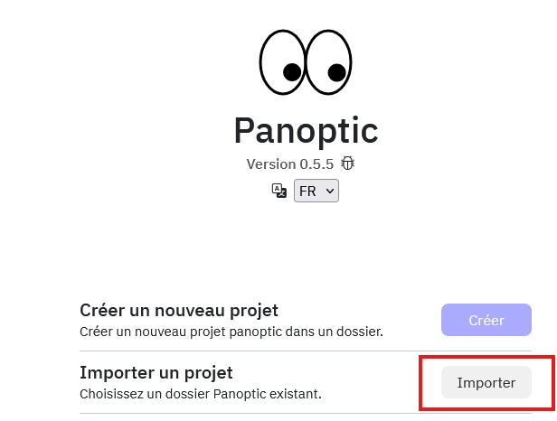

# Partager un projet

Il est possible d'importer un projet déjà existant, ce qui permet de transférer un projet d'un ordinateur à l'autre. 
Il suffit pour cela de cliquer sur importer depuis le menu principal, et de naviguer jusqu'à un dossier contenant le fichier .db du projet que l'on souhaite importer.

 

 !!! info
 Un avantage d'importer un projet c'est que cela permet de ne pas recalculer les vecteurs d'images, ces derniers sont déjà automatiquement stockés dans le fichier .db
 Un usage courant est donc de calculer les vecteurs sur un ordi puissant puis de partager le projet pour de l'exploration sur des projets moins puissants.

## Intégrer les images

Il convient tout de même de noter que de base seules les miniatures d'images sont intégrées dans un fichier .db, ainsi pour fonctionner correctement il faudra d'abord activer la sauvegarde des versions hd des images dans les paramètres du projet.
