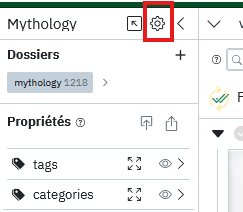
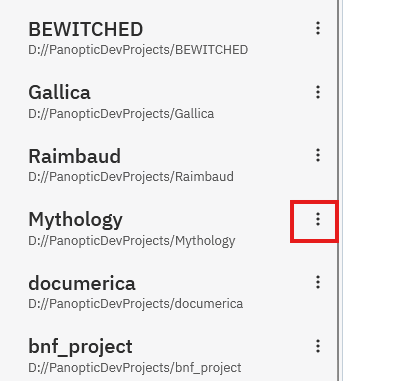

# Paramètres de projet et de plugins

Il est possible de gérer un certain nombre d'options dans les paramètres de projets.

Pour y accéder il faut cliquer sur la petite roue dentée à côté du nom du projet ouvert dans l'interface:

Dedans pourront être gérés:

- les formats d'image à sauvegarder dans la base de données, de base on ne garde que les miniatures et les versions de taille moyenne calculées lors de l'import, mais il est également possible de cocher "Save large image", faire ceci permet d'avoir un fichier de projet .db relativement autonome et sera facilement partageable à d'autres personnes sans que ces dernières n'aient besoin des images.
- les fonctions par défaut à executer pour chaque outil de similarité
- le type de vecteurs par défaut à utiliser pour les outils de similarité
- les paramètres relatifs à chacun des plugins installés

## Activer ou désactiver les plugins pour un projet

Lorsque l'on installe un plugin dans panoptic, il est automatiquement activé pour tous les projets. Mais en réalité tous les projets n'auront pas forcément besoin de tous les plugins, ainsi un projet sans image contenant du texte n'aura pas besoin du plugin d'OCR. 
Il est donc ainsi possible de désactiver les plugins non nécessaires à un projet, depuis la page d'accueil en cliquant sur les trois petits points à côté du nom du projet:

Il suffira ensuite de cocher ou décocher les plugin à activer / désactiver.
