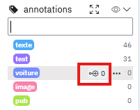

# Les tags

Les tags sont les types de propriétés les plus courants pour réaliser des annotations. Il en existe deux types différents:
- les tags simples: ils permettent d'assigner un seul et unique tag à une image
- les multi tags: ils permettent d'assigner autant de tags que l'on souhaite à une image

## Tags hiérarchiques

Dans certains cas il peut être utile de vouloir créer simultanément plusieurs annotations, par exemple si je souhaite annoter mon image avec le terme "Joconde" et que plus tard je veux regrouper toutes mes images qui sont des tableaux, il peut être utile de créer un tag tableau, et de lui ajouter comme "enfant" le tag Joconde. Une image taggée par "joconde" sera ainsi à la fois taggée comme joconde et comme tableau.

Il est possible de créer des liens de hiérarchie entre tags en cliquant sur le bouton ci dessous: 

 

 Il suffit ensuite de choisir un tag existant ou d'en créer un nouveau dans le champ qui s'affiche pour ajouter un tag "enfant".

 ## Multi "parents"

 Il est possible de créer des liens de hiérarchie complexes. Un parent peut avoir plusieurs enfant, mais il est également possible qu'un enfant ait plusieurs parents. 

 Cela permet d'assigner en une seule fois des catégories différentes, si l'on reprend l'exemple précédent, "joconde" pourrait avoir également le tag "femme" en parent, assigner le tag "joconde" assignera alors également "tableau" et "femme".

 La gestion des tags peut devenir un peu complexe s'il y en a beaucoup et avec plusieurs liens de hiérarchie, aussi il existe une fenêtre dédiée permettant de gérer plus finement les tags et les images associées.