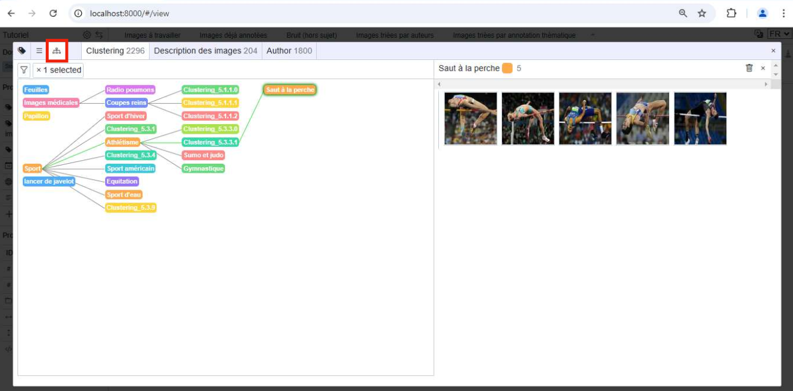
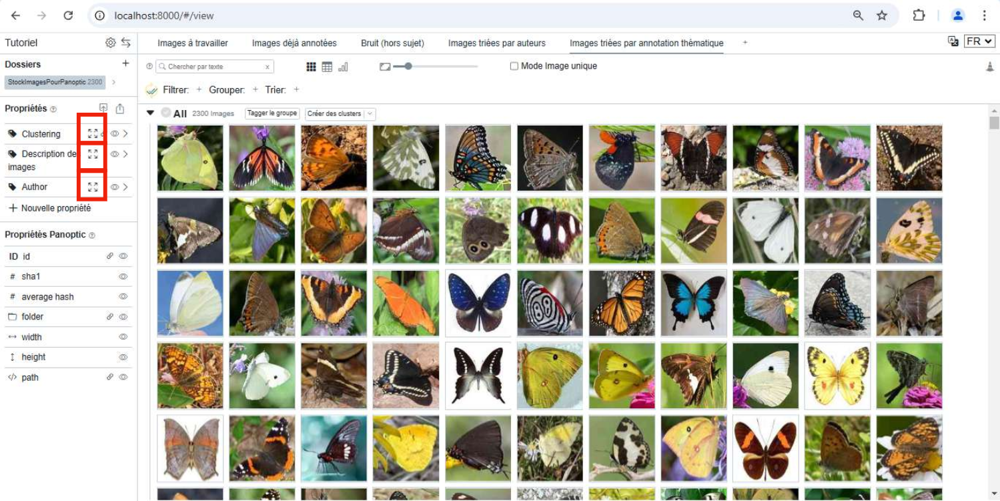

# La fenêtre de gestion des tags

La fenêtre (ou modal) de gestion des tags permet de manipuler avec plus de facilité les tags afin de pouvoir:
- les renommer
- gérer les liens de hiérarchie
- fusionner des tags si l'on estime cela nécessaire

Il existe deux vues possibles:
- la vue liste, vue par défaut qui permet d'afficher la liste des tags, de les trier par ordre alphabétique ou par nombre d'images associée à ces tags
- la vue arbre, qui est plus visuelle et est particulièrement utile lorsque l'on cherche à comprendre l'organisation hiérarchique des tags 

## Accès

Pour ouvrir cette fenêtre il suffit de cliquer sur le logo d'agrandissement à côté d'une propriété de type tag ou multitags:

## Trier les tags

Dans la vue liste, il est facile de filtrer les tags en cherchant dans le champ recherche, ou encore de les trier en prenant en compte soit leur nom soit le nombre d'images associées à chaque tag. 

Il suffit pour cela d'utiliser les boutons de tri

## Sélection multiple

Lorsque l'on clique sur un tag, ses images associées s'affiche à droite. Mais il est également possible de sélectionner plusieurs tags à la fois, en maintenant la touche controle (ou shift pour sélectionner une plage de tags), il est alors intéressant de noter que les images associées à tous les tags sélectionnés en même temps, ce qui peut être pratique pour comparer des tags.

## Fusion

Lorsque plusieurs tags sont sélectionnés il est possible de les fusionner, le tag "résultant de la fusion" sera le premier tag sélectionné. Il est possible de fusionner autant de tags à la fois que l'on souhaite. Tous les liens de parentés seront également conservés.

## Créer des liens de hiérarchie

Comme énoncé sur la page précédente il est possible de créer des liens de hiérarchie entre les tags. Cette opération est ici facilitée dans la modale et ce particulièrement dans la vue en arbre. 

Il suffit de cliquer sur un tag et de maintenir appuyé pour tirer un lien jusqu'au tag que l'on souhaite ajouter comme enfant. Le lien se fait donc dans le sens "parent -> enfant". 

Il est également possible de gérer ces liens dans la vue liste, il suffit de prendre un tag et de le glisser déposer dans la colonne souhaitée (parent ou enfant) d'un autre tag. 
