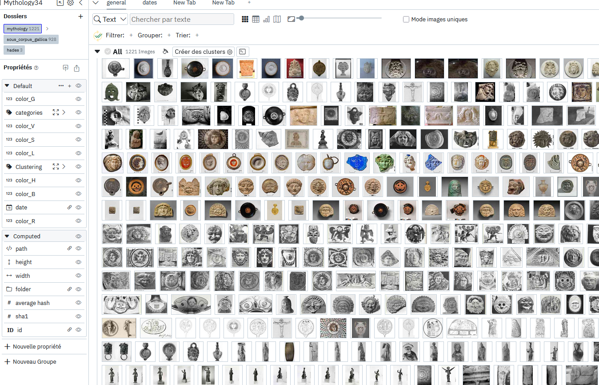
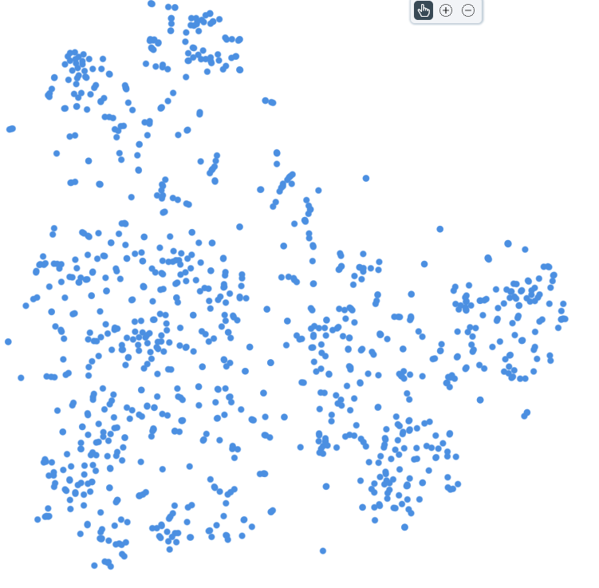
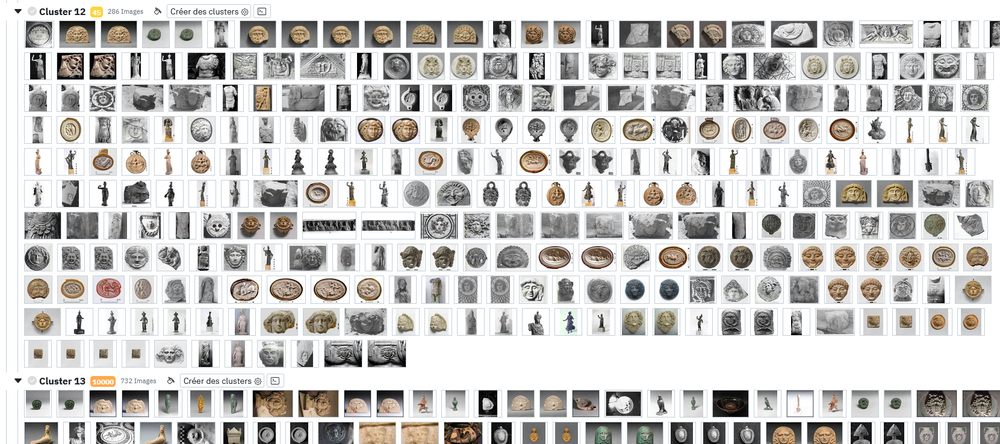

# Créer des clusters pour identifier des tendances

## Objectif

Utiliser les outils de clustering de panoptic afin d'identifier différentes catégories d'images dans un corpus.

## Corpus

Prenons l'exemple d'un corpus de photos d'oeuvres de grèce antique: 

Ce corpus semble n'être pas facilement découpable en sous ensembles bien définis comme en témoigne un aperçu dans la vue spatiale: 

## Clustering

Commencer par créer un clustering normal. Il peut être intéressant de tester de rentrer un nombre de clusters automatique (-1) si le nombre d'images n'est pas trop élevé:

On voit que pour les premiers clusters les résultats sont assez cohérents au niveau des types d'images regroupées ensemble. 
En revanche si l'on descend un peu et que l'on regarde les clusters avec un score plus élevé (donc avec une plus grande dispersion, c'est à dire une plus grande variété d'images) on constate effectivement un ensemble méritant d'être encore un peu séparé.

## Clustering imbriqués

On peut venir ainsi reclusteriser les clusters que l'on considère comme trop larges, on peut parfois retenter -1, mais également demander parfois une séparation en un nombre spécifique de clusters quand il apparaît à l'oeil nu que deux ensemble se dégagent d'un même cluster, comme par exemple le cluster entouré dans l'image ci-dessous, qui contenait des statues d'athena sur socle jaune et des statues en noir et blanc et qu'on a donc divisé par deux. 

On peut ainsi continuer itérativement et continuer à découper nos clusters jusqu'à obtenir un niveau de détail satisfaisant.

On peut noter le cas intéressant de l'exemple ci-dessous où l'on a tenté de redemander un découpage -1 à un groupe qui avait été marqué ayant un score de 1000 (globalement le chiffre maximum retourné par le clustering et considère que le groupe est très peu cohérent), et cela a à nouveau produit un groupe à 1000, c'est à dire que l'algorithme n'a pas été capable de découper de façon pertinente ce cluster là. Dans ces cas là tout particulièrement il devient nécessaire de spécifier un nombre défini de clusters à produire pour forcer un découpage:

## Sauvegarder les clusters

Une fois que l'on est satisfait on peut venir sauvegarder le résultat du cluster pour en faire une propriété persistée et par laquelle on va pouvoir venir manipuler les images. 

## Demander des recommandations

Une fois que la propriété est créée on peut grouper les images par cette propriété et venir demander des recommandations à panoptic pour voir si certains pourraient être complétés. 
Ici par exemple on observe un cluster assez large contenant des vases ou des assiettes, en métal ou en céramique, on peut alors soit demander des recommandations générale comme sur l'image ci-dessous, ce qui va nous proposer de nouvelles assiettes et vases, soit il est peut être pertinent de redécouper ce groupe afin d'être plus précis dans son contenu. 

## Renommer ses clusters

Une fois ce travail réalisé, il est possible d'ouvrir la propriété créée à l'étape de sauvegarde des clusters dans la modale des tags afin de revenir sur les clusters un à un pour les renommer et leur donner des noms pertinents en fonction de leur contenu, ou encore de venir fusionner certains tags au cas où on aurait trop découpé certains ensembles au moment du clustering. (Pour ce faire on sélectionne deux tags en maintenant la touche SHIFT).

