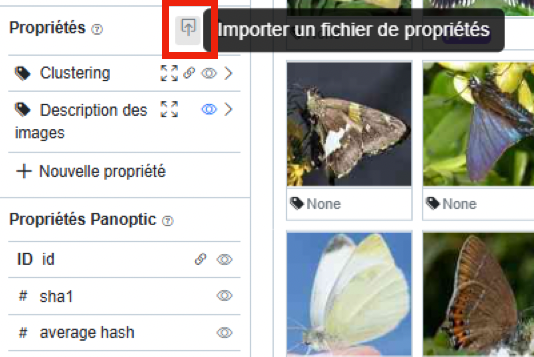

# Importer des Tags ou un Thésaurus

Si il est possible d'importer des métadonnées sous forme de propriétés [comme nous l'avons vu précédemment](/propsimport), il se peut que dans certain cas l'on veuille simplement importer une liste de tags sans forcément les lier à des images. 

Cela peut être particulièrement utile dans le cas on l'on souhaite annoter des images à partir d'un thésaurus préexistant, il suffit alors d'importer le thésaurus dans panoptic pour avoir ensuite à disposition tous les tags possibles déjà pré-crées et organisés sous forme hiérarchique. 

## Préparer ses données pour l'import

Encore une fois le format de l'import est en `csv` mais cette fois sans en tête.
Les trois colonnes correspondent au nom du tag, à la couleur du tag, et au nom du tag parent si on souhaite créer une hiérarchie.
Exemple de csv fonctionnel:

```
animal;1;
funny;0;
dog;4;animal,funny
cat;5;animal
meme;11;funny
golden retriever;6;dog
persian cat;7;cat
wholesome;2;
cute;3;wholesome
puppy;8;dog,cute
kitten;9;cat,cute
wildlife;10;animal
bear;1;wildlife
```

## Importer les données

Une fois le csv prêt, il faut également s'assurer d'avoir déjà créé une propriété de type `tag`ou `multi_tags` dans lequel on va venir importer nos tags.

Comme pour l'import des propriétés on se rend ici:



Il suffit ensuite de:
- cliquer sur Tags
- choisir un fichier csv à importer
- choisir la propriété dans laquelle importer les tags
- cliquer sur "Importer des Tags"

Si tout se passe sans erreurs les Tags sont maintenant disponibles dans la propriété qui a été sélectionnée.
