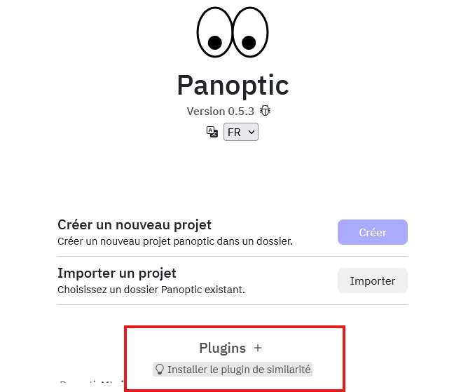

# Installation (Fin)

Par soucis de flexibilité, Panoptic est installé sans les outils de similarité. Dans la plupart des cas vous voudrez les installer pour utiliser les fonctionnalités de clustering et de similarité d'image.

Il suffit pour ceci de cliquer sur le bouton "Installer le Plugin de Similarité" sur la page d'accueil de panoptic une fois celui ci lancé.

