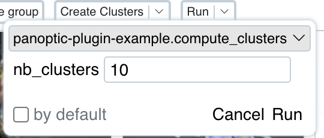
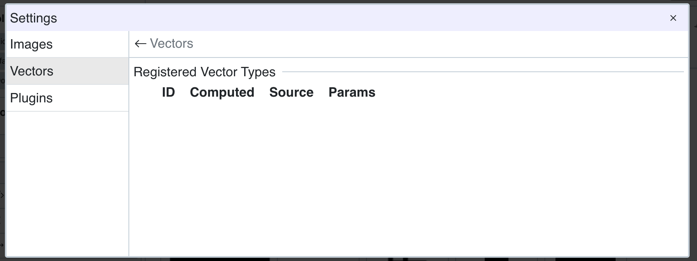
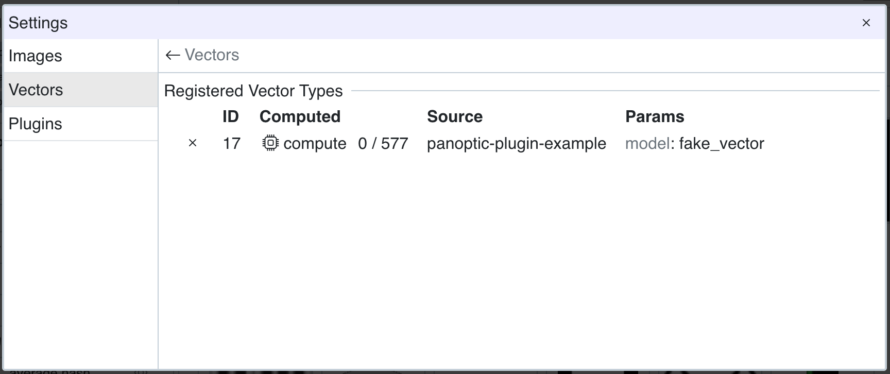

## Aperçu

Panoptic implémente un système de plugins qui vous permet de personnaliser votre façon de travailler avec vos données d'images. L'interface peut s'adapter à divers résultats d'action, ce qui en fait un outil pratique pour la visualisation et la manipulation de données.

---
### Comment ça marche

Les plugins étendent Panoptic en s'intégrant à plusieurs niveaux :

- **Actions de l'interface utilisateur** – Enregistrez des actions personnalisées qui apparaissent dans l'interface et opèrent sur les images sélectionnées.
- **Événements système** – Répondez à des événements tels que l'importation d'images ou la suppression de dossiers pour automatiser les mises à jour de données.
- **Couche de données** – Définissez des propriétés personnalisées, stockez des vecteurs et gérez des structures de données dans la base de données du projet.

Les fonctionnalités d'apprentissage automatique de Panoptic — vecteurs CLIP, clustering FAISS, recherche par similarité et détection de doublons — sont implémentées dans le plugin **PanopticML** :
[https://github.com/CERES-Sorbonne/PanopticML](https://github.com/CERES-Sorbonne/PanopticML)

Il constitue un bon exemple pour comprendre comment développer votre propre plugin.

---
### Chargement et cycle de vie des plugins

Les plugins sont chargés au niveau du projet, ce qui signifie que chaque projet Panoptic peut avoir son propre ensemble de plugins actifs avec des configurations spécifiques au projet. Lorsqu'un projet s'ouvre, ses plugins sont initialisés et restent actifs pendant toute la durée de vie du projet.
Un plugin est identifié par un nom unique.

---
### Composants principaux

**PluginProjectInterface** : L'interface principale que les plugins utilisent pour interagir avec le projet Panoptic. Elle donne accès à :

- Opérations de base de données (instances, propriétés, tags, vecteurs)
- Gestion des tâches pour les opérations de longue durée
- Système d'événements pour réagir aux changements du projet
- Déclencheurs de mise à jour de l'interface utilisateur

**APlugin** : La classe de base dont tous les plugins doivent hériter. Elle gère :

- L'enregistrement des actions pour l'intégration à l'interface utilisateur
- La gestion des abonnements aux événements
- L'accès aux ressources spécifiques du plugin

---
### Ressources des plugins

Chaque plugin a accès à :

- **Dossier de données** : Un répertoire dédié pour stocker les données spécifiques au plugin, les modèles, les caches ou tout fichier persistant dont le plugin a besoin.
- **Interface de projet** : Accès complet aux données et opérations du projet via `PluginProjectInterface`.
- **Chemin de base** : Le répertoire racine du projet pour accéder aux fichiers du projet.

---

## Configuration du plugin
Avant qu'un plugin puisse interagir avec un projet Panoptic, il doit être correctement initialisé et enregistré.
Cette section explique comment définir la classe du plugin, configurer ses paramètres et enregistrer des actions ou des événements afin qu'il s'intègre de manière transparente dans l'environnement Panoptic.

---
### Classe de base
Chaque plugin hérite de `APlugin` et est instancié avec trois paramètres :

```python
class MonPlugin(APlugin):
    def __init__(self, project: Project, plugin_path: str, name: str):
        super().__init__(name=name, project=project, plugin_path=plugin_path)
        # Initialisez votre plugin ici
```

- `project` : Le projet Panoptic chargé.
- `plugin_path` : Le chemin du système de fichiers où se trouve votre plugin.
- `name` : L'identifiant unique de votre plugin.

Pour éviter de bloquer le thread de l'application, vous pouvez exécuter des charges de travail lourdes en surchargeant la fonction asynchrone `_start()`.
`_start()` est appelée automatiquement lors du chargement du plugin.

```python
async def _start(self):
	# Charger les modèles, créer les propriétés initiales, etc.
```

---
### Attributs disponibles

| Attribut | Type | Description |
|---|---|---|
| `name` | `str` | L'identifiant du plugin, fourni par l'utilisateur lors de son enregistrement dans Panoptic. |
| `params` | `Any` | Objet `params` personnalisable qui offre un stockage persistant pour les paramètres du plugin. Ceux-ci peuvent être mis à jour depuis l'interface utilisateur. |
| `path` | `str` | Chemin du système de fichiers vers le répertoire du plugin. |
| `data_path` | `Path` | Chemin vers le dossier de données personnel du plugin. Le dossier est automatiquement supprimé lors de la suppression du plugin. |
| `project` | `PluginProjectInterface` | Interface principale pour interagir avec le projet en cours. Donne accès aux méthodes du projet et aux opérations de base de données. |
| `_project` | `Project` | **Attention :** L'objet projet réel donné à l'initialisation. À n'utiliser qu'en cas de nécessité. Les mises à jour de l'interface utilisateur ne sont pas garanties pour les modifications directes. |
| `registered_functions` | `List[FunctionDescription]` | Liste des actions actuellement enregistrées par ce plugin. |
| `vector_types` | `list[VectorType]` | Types de vecteurs enregistrés par votre plugin, mis à jour automatiquement lors de leur modification. |
| `base_key` | `str` | Clé de base de données unique utilisée pour stocker les paramètres du plugin (`<nom_plugin>.base`). |

---

### Méthodes disponibles

| Méthode | Type | Description |
|---|---|---|
| `def add_action(self, function, description)` | Méthode | Enregistre manuellement une action personnalisée en fournissant une `FunctionDescription`. |
| `def add_action_easy(self, function, hooks: list[str] = None)` | Méthode | Enregistre rapidement une fonction asynchrone en tant qu'action. Vous pouvez spécifier où l'action apparaît dans l'interface utilisateur en définissant les *hooks*. <br>Valeurs possibles : `'vector_type'`, `'vector'`, `'similar'`, `'group'`, `'execute'` |

---

### Paramètres du plugin

Les paramètres de plugin permettent aux utilisateurs de configurer le comportement d'un plugin sans modifier son code.
Définissez les paramètres de votre plugin en créant un `BaseModel` Pydantic. Ces paramètres peuvent être ajustés via l'interface utilisateur et sont automatiquement conservés dans la base de données.

```python
from pydantic import BaseModel

class MesParamsPlugin(BaseModel):
    # Drapeaux booléens
    auto_process_imports: bool = True
    
    # Paramètres numériques
    batch_size: int = 32
    confidence_threshold: float = 0.75
    
    # Options de chaîne de caractères
    output_format: str = "json"
```

Pour chaque type, l'interface utilisateur affiche un champ de saisie adapté :

- `int` : Champ numérique
- `float` : Champ numérique avec décimales
- `str` : Champ de texte
- `bool` : Case à cocher
- `PropertyId` : Sélection de propriété
- `Enum` : Champ de sélection
- `VectorType` : Sélection de n'importe quel vecteur enregistré
- `OwnVectorType` : Sélection de vecteur enregistré par le plugin lui-même

Initialisez les paramètres dans le `__init__` de votre plugin :

```python
class MonPlugin(APlugin):
    def __init__(
	    self, 
	    project: PluginProjectInterface, 
	    plugin_path: str, 
	    name: str
	):
        super().__init__(name=name, project=project, plugin_path=plugin_path)
        
        # Initialiser avec les valeurs par défaut
        self.params = MesParamsPlugin()
```

---

### Création de fonctions

Les fonctions de plugin sont des méthodes asynchrones qui effectuent des opérations sur les données du projet. Elles reçoivent un `ActionContext` et peuvent également déclarer des entrées supplémentaires :

```python
async def ma_fonction(self, context: ActionContext, param1: str):
    
    # Obtenir les instances sélectionnées par l'utilisateur
    instances = await self.project.get_instances(context.instance_ids)
    
    # Traiter les données
    results = process_data(instances, param1)
    
    # Retourner les résultats
    return ActionResult(
        groups=[results],
        notifs=[Notif(NotifType.INFO, "Succès", "Traitement terminé")]
    )
```

`ActionContext` est défini comme suit :

```python
@dataclass  
class ActionContext:  
    instance_ids: List[int] | None = None  
```
Les valeurs reflètent le contexte actuel de l'interface utilisateur dans lequel l'action a été appelée. Utilisez `instance_ids` pour savoir sur quelles instances appliquer l'action.

Des paramètres supplémentaires peuvent être définis tant qu'ils sont l'un des types pris en charge :
`int, float, str, bool, PropertyId, Enum, VectorType, OwnVectorType`

Une fonction de plugin valide doit retourner un `ActionResult` :

```python
@dataclass  
class ActionResult:  
    groups: list[Group] = None  
    notifs: list[Notif] = None  
    value: Any = None
```

- `groups` : Groupes d'images à afficher dans l'interface utilisateur.
- `notifs` : Notifications (`INFO`, `ERROR`, `WARNING`).
- `value` : Espace réservé pour les résultats à valeur unique.

---

### ActionResult
L'objet `ActionResult` sert de type de retour unifié pour les actions des plugins.

```python
@dataclass  
class ActionResult:  
    groups: list[Group] = None  
    notifs: list[Notif] = None  
    value: Any = None
```

#### Groupes
Lorsqu'elles sont appelées depuis les vues d'instances, les actions `group`, `similar` et `execute` peuvent montrer des groupes d'instances à l'utilisateur en remplissant le champ `groups`.

Un `Group` est défini comme suit :
```python
@dataclass  
class Group:  
    ids: list[int] = None  
    sha1s: list[str] = None  
    # scores des ids ou sha1s  
    scores: ScoreList = None  
    # score du groupe  
    score: Score = None  
    name: str = None
```

Vous pouvez peupler le groupe avec des `instances` ou des `images` en remplissant les champs `ids (instances)` ou `sha1s (images)`. Remplir les deux champs ne doit pas être fait et donnera des résultats inattendus dans l'interface utilisateur.

Les groupes et les instances/images peuvent avoir un score.
```python
@dataclass  
class Score:  
    value: float  
    min: float  
    max: float  
    description: str = ''  
    max_is_best: bool = True
```

Définir les champs `min`/`max` permet à l'interface utilisateur d'afficher des options de filtrage adaptées. Le champ `max_is_best` est utilisé pour inverser le sens du tri. Le champ `description` donne des informations à l'utilisateur sur l'interprétation de ce score.

Pour noter les instances/images, remplissez le champ `scores` avec une `ScoreList` :
```python
@dataclass  
class ScoreList:  
    values: list[float]  
    min: float  
    max: float  
    description: str = ''  
    max_is_best: bool = True
```
La seule différence est que le champ `value` est maintenant un tableau. Les valeurs doivent être dans le même ordre que les `ids` ou `sha1s`.

Vous pouvez également donner un nom personnalisé à votre groupe à afficher avec `name`.
Si aucun nom n'est défini, un nom par défaut sera donné.

---
#### Notifications
Une action peut retourner des notifications pour l'utilisateur.
```python

class Notif:  
    type: NotifType  
    name: str = None  
    message: str = None  
    data: Any = None  
    functions: list[NotifFunction] = None  
    
class NotifType(Enum):  
    DEBUG = "debug"  
    INFO = "info"  
    WARNING = "warning"  
    ERROR = "error"
    
class NotifFunction:  
    function: str  
    context: ActionContext
    message: str
```

 - `type` : type de notification pour le filtrage
 - `name` : nom de la notification à afficher
 - `message` : message de la notification
 - `data` : Toutes données affichées en JSON dans l'interface utilisateur
 - `functions` : Suggestion d'actions à afficher dans l'interface utilisateur.

Le champ `NotifFunction.function` attend l'identifiant de chaîne de la fonction. Vous pouvez l'obtenir en sauvegardant la description de la fonction lors de l'enregistrement des actions, comme indiqué dans la section suivante.

```python
description = self.add_action_easy(self.ma_fonction, hooks)
description.id # contient l'identifiant de chaîne de la fonction
```

---
### Enregistrement des actions
Les fonctions peuvent être enregistrées dans le constructeur du plugin `__init__()`. Deux fonctions sont disponibles pour ce faire :
```python
def add_action_easy(
	self, 
	function: AsyncCallable, 
	hooks: list[str] = None
) -> FunctionDescription

def add_action(
	self, 
	function: AsyncCallable, 
	description: FunctionDescription
) -> FunctionDescription
```
La fonction `add_action_easy()` analyse automatiquement la signature de la fonction donnée et la documentation en ligne pour générer une `FunctionDescription`. Le tableau `hooks` définit où dans l'interface utilisateur la fonction doit être rendue disponible.
Les *hooks* actuels sont :
- `'vector_type'` : Actions de création de type de vecteur
- `'vector'` : Actions de calcul de vecteur
- `'similar'` : Actions de recherche de similarité
- `'group'` : Actions de clustering et de regroupement
- `'execute'` : Actions d'exécution générales

La `FunctionDescription` donne à l'interface utilisateur toutes les informations nécessaires pour créer un élément d'interface adapté aux entrées des fonctions. Les paramètres ont des étiquettes, des descriptions et des champs de saisie personnalisables.
Pour plus de contrôle sur l'interface utilisateur, vous pouvez remplir vous-même l'objet `FunctionDescription` et enregistrer la fonction avec `add_action()`.

---
### Événements système

Les plugins peuvent également écouter des événements pour réagir en conséquence :

```python
def on_instance_import(self, 
	callback: Callable[[Instance], 
	Awaitable[None]]
)

def on_folder_delete(
	self, 
	callback: Callable[[DeleteFolderConfirm],
	Awaitable[None]]
)

```

Par exemple, le plugin `PanopticML` utilise l'événement d'importation d'instance pour calculer automatiquement les vecteurs d'image et l'événement de suppression de dossier pour mettre à jour ses index de vecteurs FAISS.

---

## Données

Les plugins ont souvent besoin de lire et d'écrire des données de projet.
Cette section détaille comment accéder aux instances, aux tags et aux vecteurs depuis la base de données, et comment valider en toute sécurité les modifications tout en gardant l'interface utilisateur synchronisée avec l'état du projet.

---
### Lecture

L'interface du plugin fournit des méthodes pour interroger divers types de données de la base de données du projet.

La première étape consiste généralement à récupérer plus d'informations sur les instances à partir de `ActionContext` :

```python
# Obtenir des instances par ID
instances = await self.project.get_instances(ids=[1, 2, 3])
# Obtenir des instances par hachages SHA1
instances = await self.project.get_instances(sha1s=["abc123...", "def456..."])
# Obtenir toutes les instances (sans filtres)
instances = await self.project.get_instances()
```

Pour chaque type de données dans Panoptic, l'interface donne accès aux requêtes de base de données correspondantes :

```python
# Dossiers
get_folders() -> list[Folder]

# Propriétés
get_properties(ids: list[int] = None, computed: bool = False) -> list[Property]

# Tags
get_tags(ids: list[int] = None, property_ids: list[int] = None) -> list[Tag]

# Valeurs de propriété d'instance
get_instance_property_values(
	property_ids: list[int] = None, 
    instance_ids: list[int] = None
) -> list[PropertyValue]

# Valeurs de propriété d'image
get_image_property_values(
	property_ids: list[int] = None, 
    sha1s: list[str] = None
) -> list[PropertyValue]

# Vecteurs
get_vectors(type_id: int, sha1s: list[str] = None) -> list[Vector]
vector_exist(type_id: int, sha1: str) -> bool

# Types de vecteurs
get_vector_types(source: str = None) -> list[VectorType]
```

Plusieurs options de filtrage sont traitées comme des conditions **OU**.

---
### Écriture

L'écriture dans la base de données du projet se fait principalement avec le **système de commit**.
Les types suivants prennent en charge la fonctionnalité d'annulation/rétablissement et la synchronisation automatique de l'interface utilisateur lors de l'utilisation de commits :

`folders`, `instances`, `properties`, `tags`, `instance_values` et `image_values`.

Un objet de commit contient un lot de mises à jour :

```python
class DbCommit:  
    empty_instances: list[int]
    empty_property_groups: list[int]
    empty_properties: list[int]
    empty_tags: list[int]
    empty_instance_values: list[InstancePropertyKey]
    empty_image_values: list[ImagePropertyKey]
    
    folders: list[Folder] 
    instances: list[Instance]
    property_groups: list[PropertyGroup]
    properties: list[Property]
    tags: list[Tag]  
    instance_values: list[InstanceProperty]
    image_values: list[ImageProperty]
    
    timestamp: datetime
```

Pour supprimer des objets, marquez-les dans les listes `empty_` correspondantes.

Certains objets ont un ID unique de type `int`. Lors de la création de nouveaux objets, vous devez définir un ID négatif. Des fonctions d'assistance sont fournies pour garantir une attribution d'ID correcte :

```python
def create_instance(
	self, 
	folder_id: int, 
	name: str, 
	extension: str, 
	sha1: str, 
	url: str, 
	width: int, 
	height: int, 
	ahash: str
) -> Instance

def create_property(
	self, 
	name: str, 
	type_: PropertyType, 
	mode: PropertyMode
) -> Property

def create_tag(
	self, 
	property_id: int,
	value: str, 
	parent_ids: list[int] = None, 
	color=-1
) -> Tag

def create_vector_type(
	self, 
	source: str, 
	params: dict 
) -> VectorType
```

Les ID négatifs sont valides à l'intérieur d'un commit et peuvent être référencés par d'autres nouveaux objets.
Par exemple, une `InstanceValue` peut référencer à la fois une nouvelle instance et une nouvelle propriété avec des ID négatifs.
Lors de l'écriture dans la base de données, Panoptic détermine automatiquement l'ordre d'insertion correct et met à jour les ID une fois les objets stockés.

Exécutez un commit à l'aide de l'une des méthodes suivantes :

```python
async def apply_commit(self, commit: DbCommit)
  
async def do(self, commit: DbCommit)
```

La fonction `do()` calcule le commit opposé avant d'appeler `apply_commit()`, permettant à l'opération d'être inversée plus tard avec `undo()`.

Deux types d'objets ne sont **pas** écrits via des commits : `vector_type` et `vector`.
Utilisez plutôt les méthodes correspondantes :

```python
async def add_vector_type(self, vec: VectorType) -> VectorType

async def add_vector(self, vector: Vector) -> Vector
```

---
## Calcul lourd et concurrence

Le backend de Panoptic s'exécute dans une boucle d'événements asynchrone. Pour éviter de bloquer le thread principal, les charges de travail lourdes doivent être exécutées dans un `ThreadPoolExecutor`.
Il existe deux manières principales de le faire dans Panoptic.

---
### Assistant asynchrone

Le moyen le plus simple de déléguer une fonction bloquante à l'exécuteur est d'utiliser l'assistant :

```python
res = await self.project.run_async(function, *args)
```

Utilisez cet assistant pour les tâches d'arrière-plan simples qui n'ont pas besoin d'être suivies ou visualisées dans l'interface utilisateur.
Il est idéal pour les opérations légères où vous avez juste besoin de décharger une fonction bloquante sur un thread d'arrière-plan et d'attendre le résultat de manière asynchrone.

Les exemples incluent :

- Exécuter de petites transformations de données
- Effectuer des opérations d'E/S de fichiers légères
- Appeler une fois une fonction de bibliothèque bloquante

---
### La file d'attente des tâches

La `TaskQueue` est conçue pour gérer et suivre les tâches d'arrière-plan.
Chaque tâche peut inclure une séquence de fonctions asynchrones ou synchrones traitées comme une seule unité de travail.

Son principal avantage est de fournir un **retour visuel dans l'interface utilisateur** via une barre de progression.
De plus, il prend en charge l'exécution de fonctions spécifiques une fois qu'un ensemble de tâches est terminé.

---
### Création d'une tâche

Héritez de la classe de base `Task` et implémentez la méthode `run()` :

```python
from panoptic.core.task.task import Task

class MaTacheDeTraitement(Task):
    def __init__(self, plugin, instance, config):
        super().__init__(priority=False)  # Mettez priority=True pour les tâches urgentes
        self.plugin = plugin
        self.instance = instance
        self.config = config
        
        # Personnaliser l'identification de la tâche
        self.name = 'Traiter l'image'  # Montré dans l'interface utilisateur
        self.key = f'task_1'  # Identifiant unique
    
    async def run(self):
        """Exécution principale de la tâche - s'exécute en arrière-plan"""
        # Utiliser _async() pour les opérations gourmandes en CPU
        result = await self.run_async(
            self._calcul_lourd,
            self.instance.url,
            self.config
        )
        
        # Stocker les résultats (les opérations de base de données sont déjà asynchrones)
        await self.plugin.project.add_vector(result)
        
        return result
    
    async def run_if_last(self):
        """Appelé une fois que toutes les tâches avec cette clé sont terminées"""
        # Reconstruire les index, mettre à jour l'interface utilisateur ou effectuer un nettoyage
        await self.plugin.rebuild_index()
    
    @staticmethod
    def _calcul_lourd(image_path, config):
        """Le travail gourmand en CPU s'exécute dans le thread de l'exécuteur"""
        # Charger et traiter l'image
        image = Image.open(image_path)
        
        # Effectuer un calcul lourd
        vectors = extract_vectors(image, config)
        
        return vectors
```

Le champ `self.key` a deux objectifs :

- Exécute la fonction `run_if_last()` sur la dernière tâche avec la même clé.
- Regroupe les tâches associées dans l'interface utilisateur.

---
### Ajout de tâches à la file d'attente

Ajoutez des tâches depuis votre plugin à l'aide de l'interface de projet :

```python
def add_task(self, task: Task):
```

La barre des tâches devrait maintenant être visible dans l'interface utilisateur.

## Exemple étape par étape

Ce guide vous montrera comment créer un nouveau plugin étape par étape. Notre objectif est d'ajouter des fonctions personnalisées à Panoptic :
- `compute_vectors()` : une fonction qui calcule les vecteurs d'image
- `compute_clusters()` : une fonction qui calcule des clusters pour une liste d'instances

Pour que ce soit très simple, nous implémenterons une fonction qui calcule les vecteurs d'une sélection d'instances avec le *hook* `execute`. Et une fonction de clustering avec le *hook* `group`. Nous n'aurons qu'un seul type de vecteur par défaut.

---
### Dossier
Un plugin est contenu dans un dossier que nous appellerons `mon_plugin`.
À l'intérieur de ce dossier, nous créons trois fichiers : `__init__.py`, `mon_plugin.py` et `requirements.txt`.

```
mon_plugin
| __init__.py
| mon_plugin.py
| requirements.txt
```

- `__init__.py` est le point d'entrée pour le chargeur de plugins.
- `requirements.txt` contient les dépendances de modules pip pour le plugin. Dans notre cas, il sera vide.
- `mon_plugin.py` contient le code du plugin.

### Initialisation du plugin
```python
# mon_plugin.py

from panoptic.core.plugin.plugin import APlugin  
from panoptic.core.project.project import Project  
from panoptic.models import ActionContext  
from panoptic.models.results import ActionResult  
  
  
class MonPlugin(APlugin):  
    def __init__(self, project: Project, plugin_path: str, name: str):  
        """  
        La méthode d'initialisation pour un plugin Panoptic. 
        Est appelée par Panoptic au lancement du projet.        
        :param project: L'instance du projet        
        :param plugin_path: Le chemin vers le module du plugin        
        :param name: L'identifiant du plugin en tant que nom unique
        """        
        # n'oubliez pas d'appeler le constructeur parent  
        super().__init__(name=name, project=project, plugin_path=plugin_path)  
        self.add_action_easy(self.compute_vectors, ['vector'])  
        self.add_action_easy(self.compute_clusters, ['group'])  
        
    async def compute_vectors(self, ctx: ActionContext):  
        res = ActionResult()  
        # du code ...  
        return res  
        
    async def compute_clusters(self, ctx: ActionContext, nb_clusters: int):  
        res = ActionResult()  
        # du code ...  
        return res
```

Cet extrait de code définit notre classe de plugin. Il est important d'appeler le constructeur parent dans notre propre fonction `__init__(..)` pour initialiser correctement le plugin.
Nous pouvons ensuite enregistrer notre fonction et sélectionner nos *hooks* d'action. La fonction `compute_vectors()` est enregistrée en tant qu'action `vector` et la fonction `compute_clusters()` en tant qu'action `group`.

Le corps de la fonction est vide pour l'instant, mais pour s'assurer que l'interface utilisateur est satisfaite, nous retournons déjà un `ActionResult`.

--- 

```python
# __init__.py
from mon_plugin import MonPlugin  
  
plugin_class = MonPlugin
```

Enfin, nous déclarons la `plugin_class` dans le fichier `__init__.py`.

Vous pouvez maintenant démarrer Panoptic et ajouter votre plugin. Vous devriez voir votre fonction de clustering sur le `ActionButton` de `group`.



Comme vous pouvez le voir, notre fonction de calcul de vecteur n'est pas visible dans l'interface utilisateur. C'est parce que nous n'avons enregistré aucun `vector_type` pour notre plugin. Les types de vecteurs servent d'identifiant pour les vecteurs.



### Création de vecteurs

Pour stocker des vecteurs dans la base de données, nous devons enregistrer un `vector_type` pour eux.
Pour cet exemple, nous n'aurons qu'un seul type pour nos vecteurs factices.

```python
async def _start(self):  
    if len(self.vector_types) == 0:  
        vec_type = self.project.create_vector_type({"model": "fake_vector"})  
        await self.project.add_vector_type(vec_type)  
        print('créé ', vec_type)
```

Nous implémentons la fonction `_start()`, qui est automatiquement appelée lors du chargement du plugin.
La variable `self.vector_types` est automatiquement mise à jour avec les types de vecteurs créés par ce plugin. Si la liste est vide, nous voulons en créer un.
Comme d'autres objets, les types de vecteurs ont un ID entier unique géré par la base de données. Vous pouvez créer un nouveau type de vecteur à l'aide de la fonction utilitaire :
```python
self.project.create_vector_type(params: dict)
```
Ensuite, nous ajoutons le type de vecteur à la base de données avec
```python
await self.project.add_vector_type(vec_type) 
```

`self.vec_type` contient maintenant notre nouveau type de vecteur, et il est visible dans l'interface utilisateur.


Et notre fonction de calcul de vecteur est maintenant appelable en cliquant sur le bouton `compute` dans la ligne du vecteur.

---

Nous voulons placer les images dans un espace vectoriel à 1 dimension où la valeur représente la teinte principale (0-255) de l'image.
Notre fonction de calcul ressemble à ceci :
```python
@staticmethod  
def compute_hue_vector(path: str):  
    img = Image.open(path)  
    img = img.convert('RGB')  
    img_hsv = img.convert('HSV')  
    
    # Obtenir les données HSV en tant que tableau numpy  
    hsv_array = np.array(img_hsv)  
    
    # Extraire le canal de teinte (premier canal en HSV)  
    hue_channel = hsv_array[:, :, 0]  
    
    # Aplatir et calculer l'histogramme  
    hue_flat = hue_channel.flatten()  
    
    # Obtenir la valeur de teinte la plus courante  
    counts = np.bincount(hue_flat)  
    dominant_hue = np.argmax(counts)  
    
    # Vecteur à 1 dimension. Convertir en float32 pour correspondre au type de la base de données
    return np.array(int(dominant_hue), dtype='float32')
```

et notre fonction `compute_vectors()` mise à jour

```python
async def compute_vectors(self, ctx: ActionContext):  
    # obtenir les instances de la base de données  
    instances = await self.project.get_instances(ids=ctx.instance_ids)  
    # ne garder qu'une seule instance par sha1  
    unique = list({i.sha1: i for i in instances}.values())  
    # obtenir notre id de type de vecteur  
    type_id = self.vector_types[0].id  
    
    for instance in unique:  
        # calculer le vecteur de teinte dans l'exécuteur pour éviter de bloquer 
        # le thread principal  
        hue_vector = await self.project.run_async(
			self.compute_hue_vector, instance.url
		)  
        # créer l'objet vecteur à écrire dans la base de données  
        vector = Vector(type_id=type_id, sha1=instance.sha1, data=hue_vector)  
        # écrire dans la base de données  
        await self.project.add_vector(vector)  
  
    # envoyer une notification de succès  
    notif = Notif(
	    type=NotifType.INFO, 
	    name='compute_vectors', 
	    message='Tous les vecteurs ont été calculés'
	)  
    # toujours retourner un ActionResult  
    return ActionResult(notifs=[notif])
```

Il est important d'envelopper les fonctions gourmandes en calcul avec la fonction `run_async`.
Encore mieux, vous pouvez utiliser les interfaces `Task` et `TaskQueue` pour exécuter des calculs en arrière-plan.
Vous pouvez vous référer au plugin officiel **PanopticML** pour un exemple qui utilise un objet `Task`.

À la fin, nous retournons une notification pour indiquer que le calcul s'est terminé avec succès.
Cette notification apparaîtra dans l'interface utilisateur une fois l'action terminée.


Si votre fonction plante sans gestion d'erreur appropriée, Panoptic générera automatiquement une notification d'erreur qui inclut la stacktrace.


---

### Clustering 
Maintenant que nous avons des vecteurs, nous pouvons commencer le clustering. Pour notre exemple, nous allons trier les images par valeur de teinte, puis créer un nombre choisi de groupes de taille égale.

Le calcul ressemble à ceci :
```python
@staticmethod  
def group_instances_by_hue(
	instances: list[Instance], 
	sha1_to_hue: dict[str, int], 
	num_groups: int
	):  
    """  
    Trier les instances par teinte et les regrouper.    
    """   
    # Utiliser np pour la simplicité
    id_array =  np.array([i.id for i in instances])  
    hue_array =  np.array([sha1_to_hue[i.sha1] for i in instances])  
    
    # Trier par teinte  
    sorted_indices = np.argsort(hue_array)  
    sorted_ids = id_array[sorted_indices]  
    sorted_hue = hue_array[sorted_indices]  
    
    # Diviser en groupes de taille égale  
    id_groups = np.array_split(sorted_ids, num_groups)  
    hue_groups = np.array_split(sorted_hue, num_groups) 
    
    return id_groups, hue_groups
```

Nous devons intégrer ce résultat dans l'API `ActionResult`.
```python
async def compute_clusters(self, ctx: ActionContext, nb_clusters: int):  
    # obtenir les instances de la base de données  
    instances = await self.project.get_instances(ids=ctx.instance_ids)  
    # obtenir nos propres vecteurs de la base de données  
    vectors = await self.project.get_vectors(self.vector_types[0].id)  
    # mapper sha1 à la teinte avec les données du vecteur  
    sha1_to_hue = {v.sha1: v.data.tolist()[0] for v in vectors}  
    # calculer les vecteurs avec les données  
    id_groups, hue_groups = self.group_instances_by_hue(
	    instances, sha1_to_hue, nb_clusters
	)  
    
    # itérer sur le résultat et remplir les objets Group  
    groups = []  
    for id_group, hue_group in zip(id_groups, hue_groups):  
        # obtenir la teinte min et max de chaque groupe  
        min_hue = hue_group.min()  
        max_hue = hue_group.max()  
        # créer un groupe d'ID d'instance  
        group = Group(
	        # extraire les ID d'instance du tableau np.array
	        ids=id_group.tolist(), 
	        # choisir un nom pour le groupe
	        name=f"Groupe de teintes : {min_hue}-{max_hue}"
	    )  
        groups.append(group)  
      
    # retourner les clusters  
    return ActionResult(groups=groups)
```

L'implémentation de `compute_vectors` est facile à suivre. D'abord, nous récupérons toutes les données nécessaires pour calculer notre clustering, puis nous utilisons `ActionResult` pour retourner les groupes à l'interface utilisateur.


Appelez la fonction depuis l'`ActionButton` "Créer des clusters" et le résultat devrait être visible dans l'interface utilisateur. Assurez-vous d'avoir exécuté l'action de calcul de vecteur auparavant.

Nous espérons que ce guide a pu rendre la logique derrière le système de plugins plus compréhensible. Le plugin officiel **PanopticML** est la meilleure ressource pour avoir des exemples plus complexes d'utilisation de plugins.