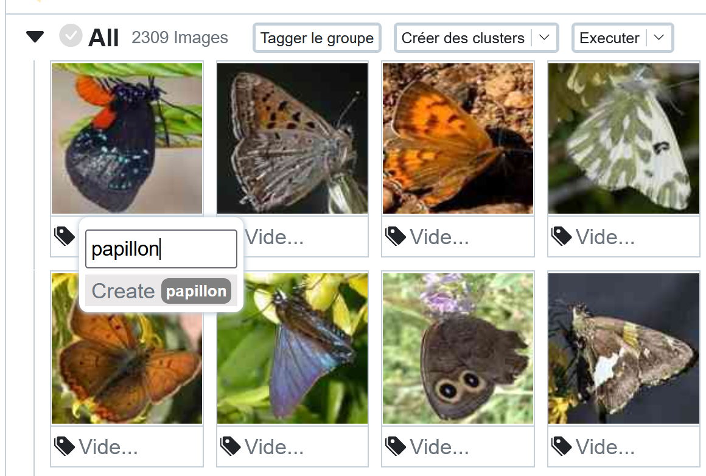
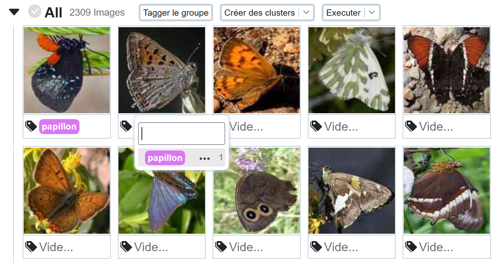
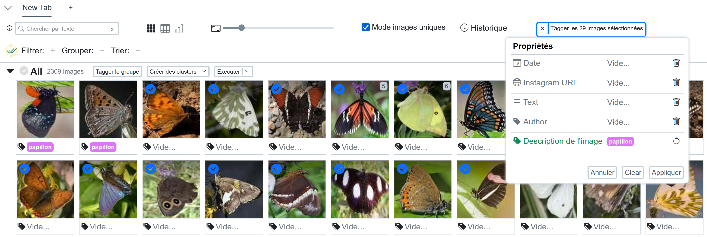
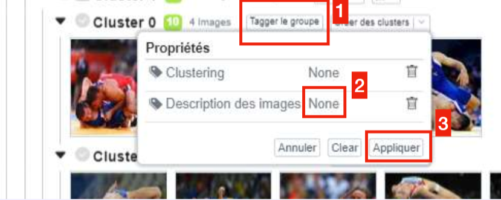
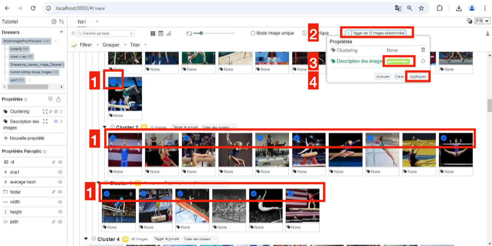
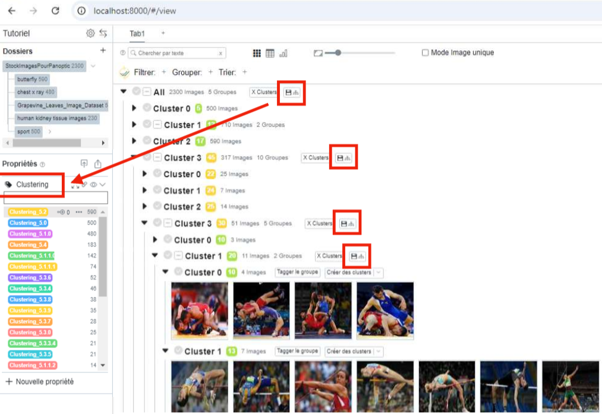
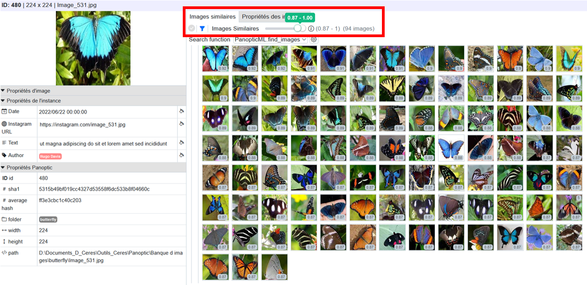
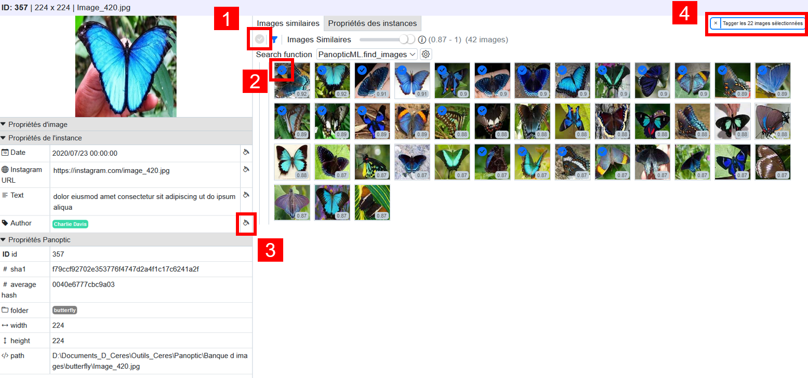
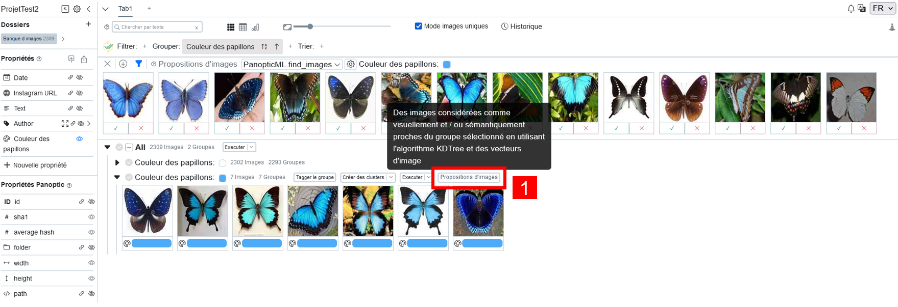
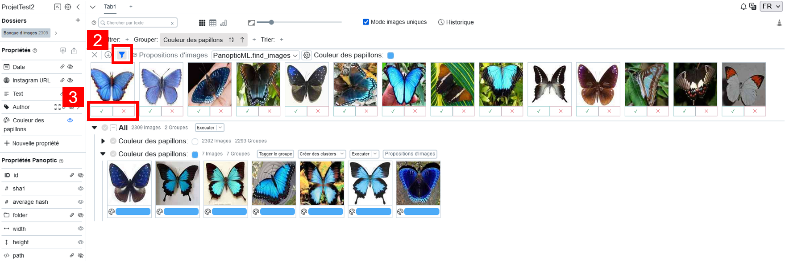

# Annoter les propriétés

Une fois une propriété créée et affichée, il est possible d'annoter les images importées.

Lorsqu'une propriété est affichée, une ligne vide est affichée en dessous de chaque image. Si l'on affiche deux propriétés, il y en aura deux d'afficher sous chaque image, etc.

## Annoter une image

 Pour annoter une seule image, il suffit de cliquer sur l'espace vide associé à la bonne propriété sous l'image, et de compléter par l'annotation que l'on souhaite.

Une fois une annotation créée, celle-ci est automatiquement proposée pour les prochaines annotations.

## Annoter par lots

Il est possible d'annoter les images par lots. Lorsque l'on passe la souris sur une image, une coche cliquable s'affiche en haut à droite de l'image. En cliquant, la coche devient bleue : l'image est sélectionnée. On peut comme cela en sélectionner plusieurs. Il est possible de sélectionner toutes les images situées entre deux images, en sélectionnant ces deux images tout en maintenant la touche maj/shift appuyée.

Lorsque plusieurs images sont ainsi sélectionnées, apparaît en haut à droite de Panoptic une option "Tagger les X images sélectionnées". En cliquant dessus, on peut sélectionner autant d'annotations qu'on le souhaite pour toutes les images sélectionnées. Cliquez enfin sur "Appliquer" et les images seront annotées.

!!! Attention

    Une fois les images annotées de cette manière, pensez bien à désélectionner les images sélectionnées pour ne pas les réannoter plus tard. Pour les désélectionner, cela se fait en cliquant sur la crois (x) à gauche de "Tagger les X images sélectionnées" 

## Annoter un cluster d'images similaires

### Annoter un cluster en entier

Pour réaliser des clusters d'images similaires, voir la documentation sur les [clusters](https://panopticorg.github.io/start/clusters/).

Il est possible d'annoter tout un cluster en cliquant sur l'option "Tagger le groupe" au-dessus d'un cluster.

Dans la fenêtre qui s’ouvre, cliquez à côté de la propriété créée (sur "None"), et choisissez un tag déjà existant ou créez en un. Enfin, faites "Appliquer".

### Annoter une partie d’un cluster, ou plusieurs parties de plusieurs clusters

Si les clusters proposés ne conviennent pas suffisamment pour annoter, il est possible de ne sélectionner qu’une partie des images qui s’affichent pour les annoter. Il suffit ici de reproduire l'annotation par lots décrite plus tôt, mais au sein d'un cluster.

!!! Important

    Il est possible de réaliser des sous-clusters (voir la documentation sur les [clusters](https://panopticorg.github.io/start/clusters/)). Ils fonctionnent comme les clusters et sont donc annotable de la même manière.

### Sauvegarder les clusters.

Par défaut, les clusters ne sont pas sauvegardés, car il s’agit de propositions informatiques d’associations d’images qu’un humain doit valider.

Si l’on souhaite sauvegarder un cluster, il faut donc le spécifier en cliquant sur l’icône de disquette à côté des clusters ouverts. On peut sauvegarder chaque cluster ou sous-cluster indépendament, ou bien l’ensemble des clusters directement, en cliquant sur la disquette située à la racine (tout en
haut, au-dessus des premières images).

Lorsque l’on sauvegarde des clusters, ceux-ci s’enregistrent dans une propriété dédiée, nommée "clustering", que vous pouvez retrouver dans la partie gauche de l’écran, sous la section propriété.

Vous pouvez ensuite renommer chaque élément de cette propriété pour donner du sens au clustering réalisé, en vous rendant dans la fenêtre de gestion des tags (voir la documentation sur la [gestion des propriétés de type Tag et Multitags](https://panopticorg.github.io/start/properties/)).

## Annoter des images similaires à une image

Lorsque l'on clique sur une image, s'ouvre une fenêtre contextuelle proposant, à gauche, les propriétés de l'image, et à droite, les images similaires à cette image sélectionnée.

Vous pouvez annoter directement, par lots, ces différentes images. Plusieur soptions ici : 

Vous pouvez au choix : sélectionner toutes les images affichées (1), ou bien sélectionner (ou désélectionner) certaines images (2) pour affiner.

Vous pouvez ensuite cliquer sur l’icône "pot de peinture" (3) pour annoter toutes les images sélectionnées en fonction de la propriété choisie. Vous pouvez également cliquer en haut à droite sur "Tagger les X images sélectionnées" pour ouvrir un menu affichant toutes les propriétés disponibles, et tagger les images sélectionnées comme bon vous semble (à l’identique de l’image originale, ou bien différemment).

## Annoter des images similaires à un groupe d'images

Si vous avez déjà commencé à annoter votre corpus d’images, vous pouvez poursuivre l’annotation en cherchant des images similaires à un groupe d’images déjà annotées. Pour ce faire, il faut d’abord grouper les images en fonction d’une propriété (voir la documentation sur le [groupage d'images](https://panopticorg.github.io/start/filters/)). Pour chaque groupe, il y a alors un bouton "Propositions d’images" sur lequel vous pouvez cliquer (1).

Si des filtres sont actifs dans la vue dans laquelle vous travaillez, il est possible de choisir d’afficher des images similaires seulement présentes dans cette vue, ou non, en activant ou désactivant le filtre (2).

Ajouter des images au groupe :

Une fois que la fenêtre de proposition d’images est apparue, il vous suffit de cliquez sur la coche verte ou la croix rouge (3), pour accepter que l’image proposée rejoigne le groupe associée, ou non (c’est-à-dire, pour valider ou non que l’image soit taggée avec l’annotation correspondante).

