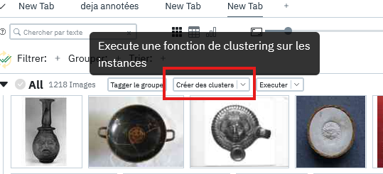
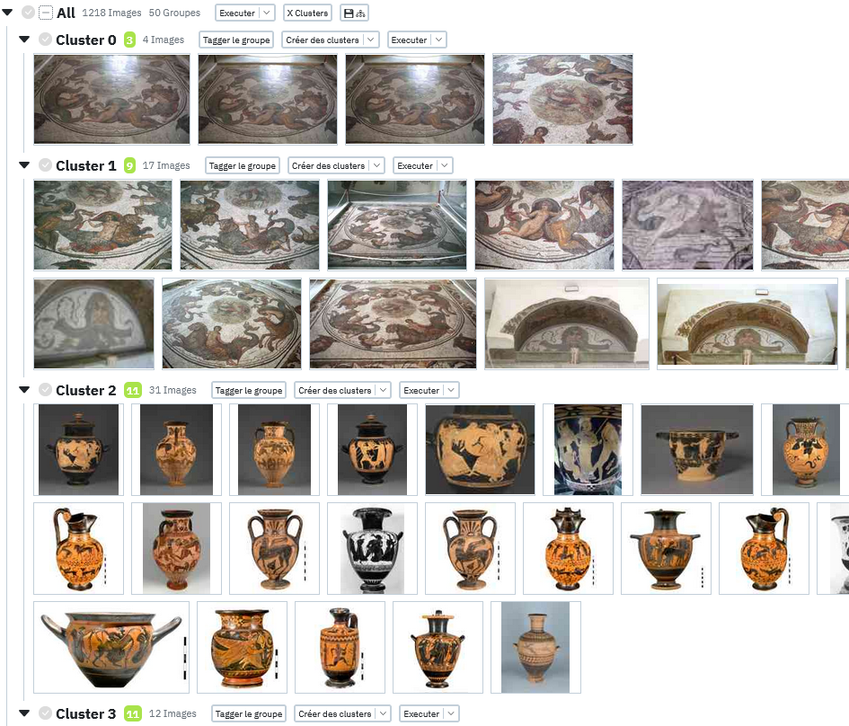
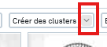
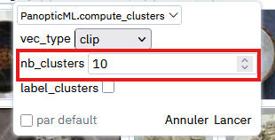

# Les Clusters

Les clusters sont une notion particulièrement importante dans le fonctionnement de Panoptic.
Une fois les vecteurs calculés, les images peuvent être regroupées automatiquement en **clusters**. Contrairement aux groupes créés avec des propriétés, les clusters sont paramétrables, peuvent être générés avec différents algorithmes, et ne sont pas déterministes (un même clustering peut produire des résultats légèrement différents selon les exécutions).

## Créer des clusters

Une fois le projet lancé et les plugins chargés, cliquer sur le bouton "Créer des clusters":

Cela devrait séparer vos images en 10 groupes distincts par similarité comme sur l'image ci dessous:

### Les paramètres

Il est également possible de choisir le nombre de clusters que l'on souhaite produire en cliquant sur la petite flèche se situant sur le bouton "Créer les clusters pour ouvrir les paramètres".

Il suffit ensuite de modifier la valeur de nb_clusters pour indiquer le nombre de clusters à créer.

!!! Info
    Vous pouvez remarquer qu'il existe d'autres paramètres pour des usages plus avancés que nous verrons plus tard.

### Les scores

## Imbriquer des clusters

## Sauvegarder un clustering

## Différentes méthodes