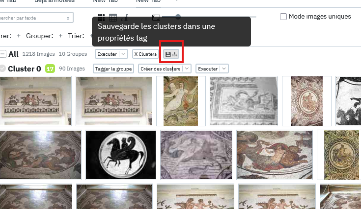
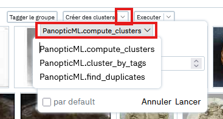

# Les Clusters

Les clusters sont une notion particulièrement importante dans le fonctionnement de Panoptic.
Une fois les vecteurs calculés, les images peuvent être regroupées automatiquement grâce en **clusters**. Contrairement aux groupes créés avec des propriétés, les clusters sont paramétrables, peuvent être générés avec différents algorithmes, et ne sont pas déterministes (un même clustering peut produire des résultats légèrement différents selon les exécutions).

## Créer des clusters

Une fois le projet lancé et les plugins chargés, cliquer sur le bouton "Créer des clusters":

Cela devrait séparer vos images en 10 groupes distincts par similarité comme sur l'image ci dessous:

### Les paramètres

Il est également possible de choisir le nombre de clusters que l'on souhaite produire en cliquant sur la petite flèche se situant sur le bouton "Créer les clusters pour ouvrir les paramètres".

Il suffit ensuite de modifier la valeur de nb_clusters pour indiquer le nombre de clusters à créer.

!!! Info
    Il existe d'autres paramètres visibles sur cette image pour des usages plus avancés que nous verrons plus tard.

!!! Nombre de clusters automatique
    Il est également possible de demander un nombre automatique de clusters à produire en entrant `-1` dans la valeur nb_clusters, mais il est à noter que cela prendra plus de temps à calculer et que le résultat sera vraiment variable d'un corpus à l'autre.

### Les scores

Les clusters produits possèdent chacun un score affiché en couleur à côté de leur nom, ces scores sont un indicateur de la pertinence du cluster, c'est à dire à quel point les images au sein de ce dernier sont proches les unes des autres. Plus le score est faible et plus le cluster est considéré comme **cohérent.** Ce score est là pour donner une *idée générale* et peut **varier d'un corpus à l'autre**. Autrement dit, si un score de 15 peut donner un cluster avec des images presque visuellement identiques dans certains corpus, cela sera peut être plus disparate dans d'autres. Cela dépend de la diversité et du nombre d'images présentes dans ce dernier.

## Imbriquer des clusters

Une fonctionnalité importante de panoptic et la possibilité d'imbriquer des clusters. En effet, le postulat suivi ici est de dire que les modèles d'apprentissage automatique ne produiront jamais de clustering parfait et que celui ci doit / peut être retravaillé par la personne utilisant panoptic. De fait il est possible de rediviser un cluster en rappuyant sur le bouton "Créer des clusters" afin d'affiner le regroupement des images. 

Ce processus peut être d'ailleurs répété indéfiniment (enfin tant qu'il reste des images à séparer).

## Sauvegarder un clustering

Le processus de clustering est avant tout un outil d'exploration est n'est pas sauvegardé automatiquement dans panoptic. Si l'on veut persister le travail effectué grâce à cet outil, il faut soit avoir annoté les images se trouvant dans les clusters soit cliquer sur le bouton de sauvegarde des clusters:

Ce bouton créé une nouvelle propriété nommée "Clustering" qui assignera à chaque image le cluster où elle se trouvait sous forme de tag. Il est à noter que comme les clusters peuvent être imbriqués les tags pourront eux mêmes être hiérarchiques.

## Différentes façons de clusteriser

La méthode principale présentée jusqu'ici est celle par défaut "PanopticML.compute_clusters" mais il existe dans le plugin de similarité d'autres façons de créer des clusters, et d'autres plugins pourront également proposer d'autres façons. Celles disponibles par défaut dans le plugin de similarité sont les suivantes:

- compute_clusters: version par défaut qui utiliser l'algorithme KMeans et regroupe les images en fonction d'un nombre de clusters demandés, pratique pour itérer rapidement et effectuer de "grosses coupes" dans un corpus.
- find_duplicates: créé des groupes en assurant un minimum de seuil de similarité entre les images de ce groupes, cela peut être pratique pour identifier les doublons ou doublons proches dans un corpus. Le seuil de similarité peut être modifié pour être plus ou moins permissif.
- cluster_by_tags: *experimental*, prend en entrée une propriété de type tags ou multitags et essaie de ratacher chaque image au tag dont elle est le plus proche.

Cette méthode peut être choisie depuis un champ déroulant dans les paramètres de clustering: 

## Pour aller plus loin

Pour des exemples concrets d'utilisation voir [un exemple de méthodologie utilisant le clustering](/method/clusters)