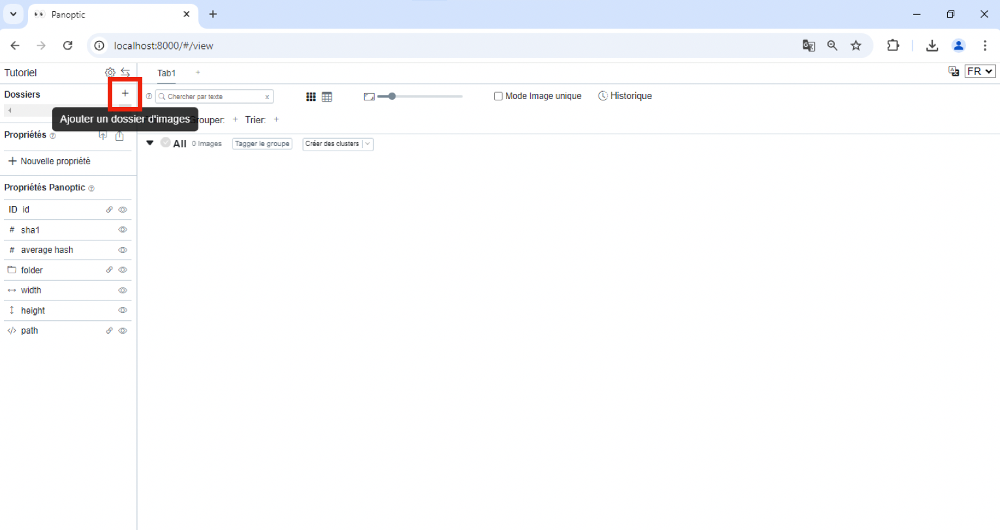
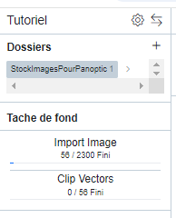

# Importer des images

Une fois un projet créé ou ouvert, la fenêtre principale de Panoptic s'ouvre.

Pour importer des images, il faut cliquer sur le "**+**" en haut à gauche dans Panoptic. Il faut alors sélectionner le dossier où se trouvent les images que vous souhaitez importer. 

!!! Précision    
    L'import d'un dossier importe également tous les sous-dossiers contenus dans le dossier.

    Vous pouvez importer successivement plusieurs dossiers contenant des images.

    Il ne faudra pas bouger le dossier qui contient les images, ni en renommer le chemin ensuite.

## Suivi de l'import

Une fois que vous avez sélectionné le ou les dossiers d'images à importer, le temps d'import et de calcul prend généralement plusieurs minutes. Cela dépend de la puissance de votre ordinateur et du nombre d'images importées. 

Vous pouvez suivre l'avancée de l'import à gauche, dans la section "Tâche de fond". Plusieurs informations sont indiquées : l'avancement de l'import des images, de leurs miniatures, et de leur vectorisation.

!!! Important
    Important ! Pour que les images soient vectorisées lors de leur import, il faut avoir au préalable [installé le module "PanopticML"](install/install_plugin/).

!!! Rappel 
    A quoi sert la vectorisation des images ? Dans les grandes lignes, la vectorisation des images est un préalable nécessaire à la recherche d'images similaires les unes aux autres, en fonction de leur contenu formel (ce que l'on voit dans les images).