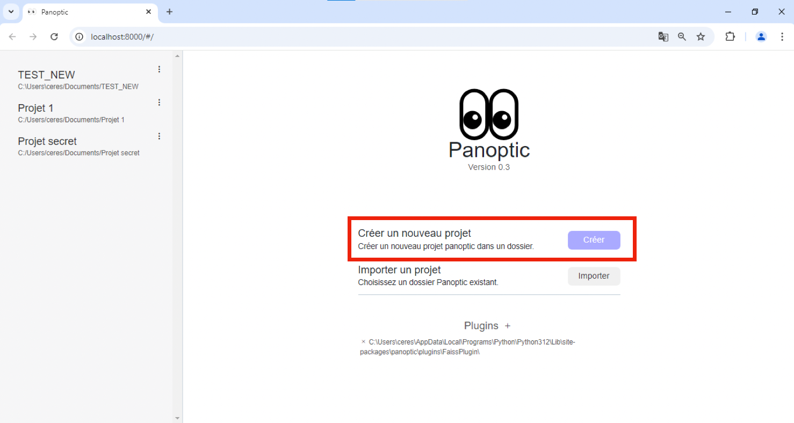
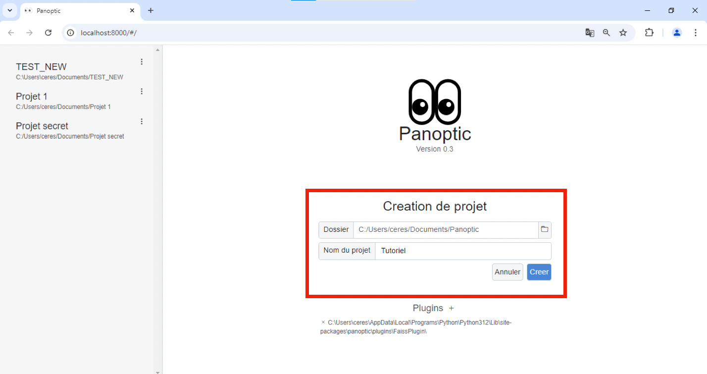
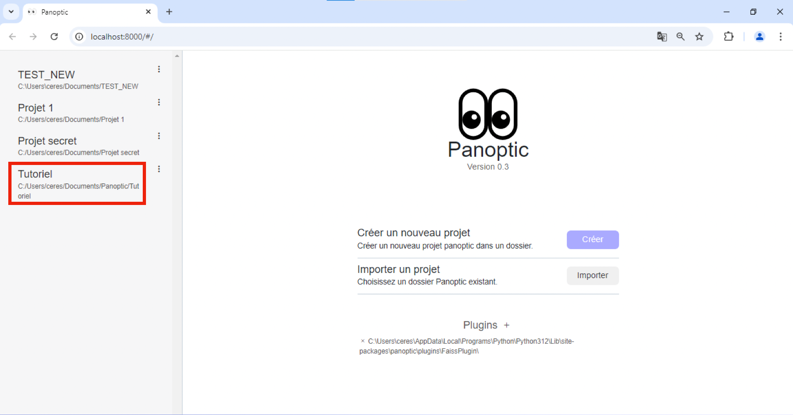
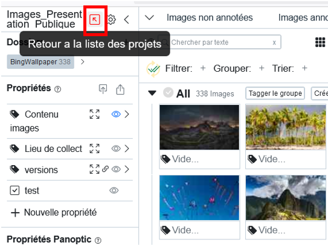

# Les Projets

Panoptic permet de travailler avec vos corpus, localement, sur votre ordinateur. Panoptic ne propose donc pas de collections d'images prédéfinies, les jeux de données doivent être constitués en amont.

Toutes les actions réalisées au sein d'un projet sont automatiquement sauvegardées, localement, sur votre ordinateur. Si vous fermez un projet, avant d'y revenir plus tard, vous y retrouverez toutes les actions que vous y avez effectuées.

Panoptic permet de travailler avec autant de projets qu'on le souhaite.

Dans un projet, vous pouvez travailler avec plusieurs corpus d'images si vous le souhaitez, importés en une seule fois ou en plusieurs fois.

## Page de gestion des projets Panoptic

Les projets se gèrent dans une page dédiée (création, importation, suppression), qui est la page d'accueil de Panoptic : elle s'ouvre lors du lancement du logiciel et reste accessible n'importe quand.
            
Dans la page de gestion de projets, cliquez sur "Créer" à côté de "Créer un nouveau projet".

Il s'agit alors de définir l'endroit dans votre ordinateur – (le "dossier") – où vous voulez enregistrer votre projet.

!!! Attention
    Il ne faudra pas bouger ce dossier/en renommer le chemin ensuite.
    
    Créez ce dossier dans un dossier différent de celui qui contient votre corpus d'images.
    
    Créez donc au préalable, où cela vous arrange, un dossier "panoptic" dans lequel vous viendrez enregistrer tous vos projets à l'avenir.

Nommez ensuite votre projet dans le champ "Nom du projet".

Faites enfin "Créer" : votre projet est créé et la page de travail de Panoptic s'ouvre.
     
## Accéder à un projet existant

Lorsque vous ouvrez Panoptic, choisissez à gauche le projet que vous souhaitez ouvrir en cliquant dessus. 

    
Si vous êtes déjà dans un projet ouvert et que souhaitez changer de projet, en haut à gauche, cliquez sur la flèche.