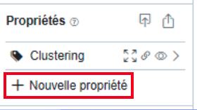
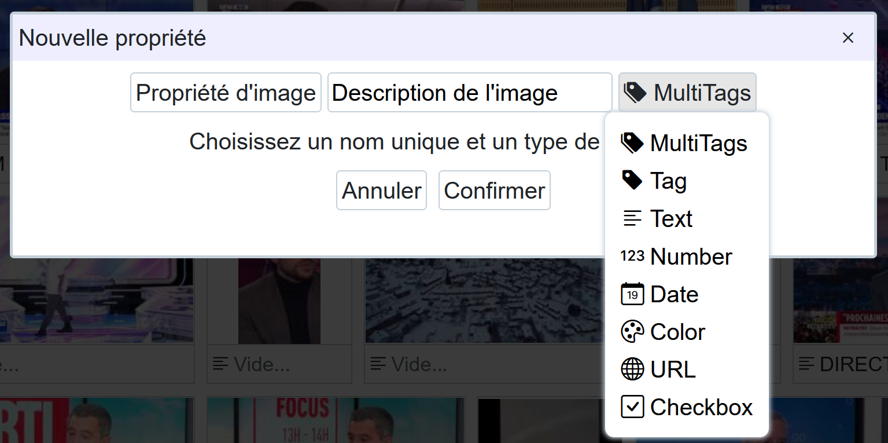
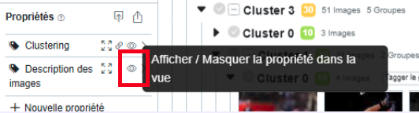
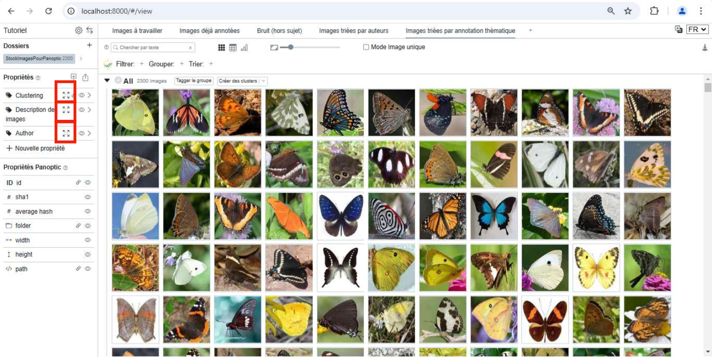
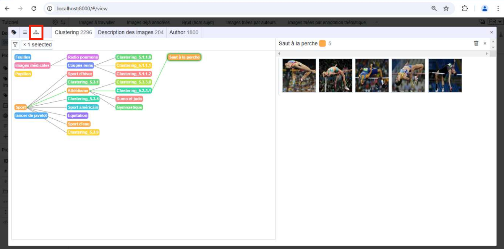
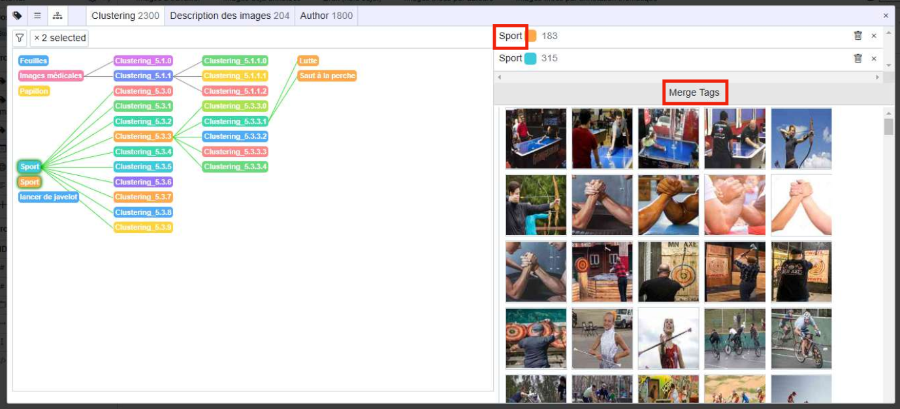
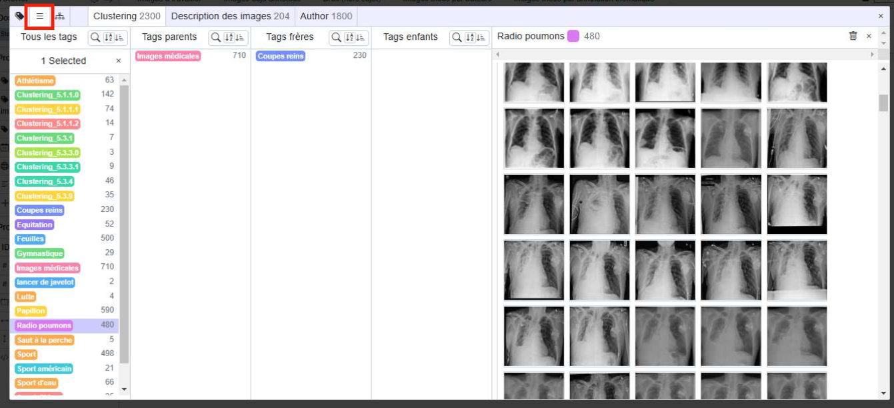

# Les Propriétés

Pour donner du sens aux images étudiées dans l’interface de Panoptic, cela se fait en **créant** et **définissant** un ensemble de PROPRIÉTÉS. C’est à partir des propriétés créées que vous pouvez annoter les images. Ces propriétés sont de plusieurs types (en anglais) : 

- text, 
- numeric, 
- tag, 
- multi_tags, 
- checkbox (case à cocher),
- url, 
- date,
- color.

Une fois les propriétés créées, vous pouvez associer des annotations à chaque image séparément, ou bien à des lots d’images, en lien avec une propriété particulière, ou bien avec plusieurs propriétés. Les propriétés peuvent être créées au fur et à mesure, et pas nécessairement définies en amont.

## Créer et afficher une propriété

Pour annoter vos images, il faut au préalable créer au moins une propriété, qui contiendra des annotations de types spécifiques (tag, date, text, number...).
    
Pour créer une propriété (par exemple de type "MultiTags") :
     
- À gauche, cliquez sur "Nouvelle propriété".

-  Nommez la propriété, choisissez son type et choisissez s'il s'agit d'une propriété d'image ou d'instance. Faites "Confirmer".

- Affichez (ou masquez) la propriété créée en cliquant sur l'icône d'oeil situé à côté de son nom.

!!! Important

    Il n'est pas nécessaire de définir en amont les propriétés dont vous aurez besoin au cours du travail. Celles-ci peuvent être créées au fur et à mesure.

## Propriétés d'images, propriétés d'instances

Un point qui peut être compliqué à décider est le choix entre **propriétés d'images** et **propriétés d'instances**. Pour comprendre la différence entre les notions d'**images** et d'**instances d'images**, vous pouvez vous référer au [glossaire](https://panopticorg.github.io/concepts/).

- Si vous choisissez l'option **propriété d'images**, vous annoterez, pour la propriété créée, toutes les instances d'une même image. 
- Si vous choisissez l'option **propriété d'instance**, vous annoterez une seule instance de l'image.

Par exemple, vous travaillez avec des tweets qui contiennent des images. Si 50 tweets différents mobilisent une même image :

- Choisir l'option **propriété d'images** vous permettra d'annoter les 50 tweets d'un coup, qui mobilisent une même image : c'est pertinent si vous souhaitez décrire l'image en tant que telle, mais ça ne l'est pas si vous souhaitez annoter le contexte de mobilisation de l'image.
- Choisir l'option **propriété d'instance** vous permettra d'annoter les tweets un par un : c'est pertinent si vous souhaitez décrire le contexte de mobilisation de l'image, mais ça ne l'est pas si vous voulez annoter l'image en tant que telle.

## Relations entre propriétés

Il est possible de définir des relations hiérarchiques (parent-enfant) entre annotations, pour les propriétés de type **Tag** et **MultiTags**. Ces propriétés sont en effet spécifiques et peuvent être gérées dans un espace dédié. Cet espace s'ouvre depuis le volet des propriétés, situé à gauche de l'écran, en cliquant sur le symbole associé.

!!! Important

    Dans cet espace de gestion des tags et de leurs relations, deux vues sur ces relations sont disponibles en fonction des besoins : la vue "arbre" et la vue "liste".

### Vue "arbre" des propriétés Tag et Multitags

Dans l'exemple, la vue "arbre" montre les relations parents-enfants existantes (sport/athlétisme/saut à la perche ; images médicales/poumons). Le parentage des différentes annotations réalisées s’effectue en attrapant avec la souris une annotation et en la glissant sur l’annotation de niveau plus général.

Dans cet espace de gestion des tags, vous pouvez renommer vos différents tags, pour les améliorer si besoin, ou encore les fusionner entre eux, si vous repérez des doublons par exemple. Pour les fusionner, sélectionnez plusieurs tags (à l’aide de la touche maj/shift) et faites "Merge Tags".

### Vue "liste" des propriétés Tag et Multitags

Vous pouvez également afficher les images en vue "liste". Ici, lorsque vous sélectionnez un tag, cela affiche ses différentes relations : parents, frères (mêmes parents), enfants.

## Les Propriétés Panoptic

Les "PROPRIÉTÉS PANOPTIC" sont des propriétés non manipulables. Elles sont calculées par le logiciel lors de l’import des images, et vous fournissent quelques métriques : un identifiant uniquement pour chaque image ("ID"), une signature propre à chaque image, pour repérer les doublons parfaits ("sha1"), une signature propre aux images grossièrement similaires ("average hash"), leur dossier d’origine sur votre ordinateur ("folder"), ainsi que leur chemin absolu ("path"), et enfin leurs dimensions ("width" et "height")