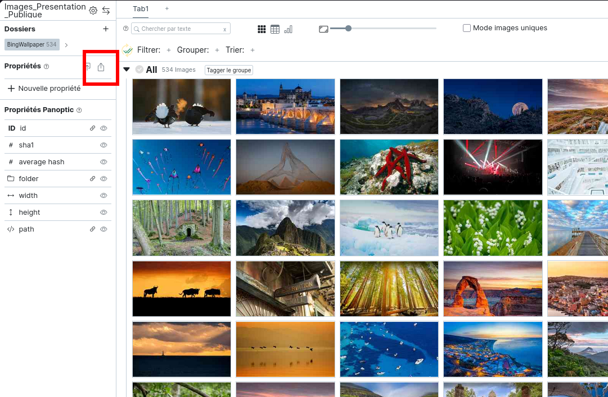
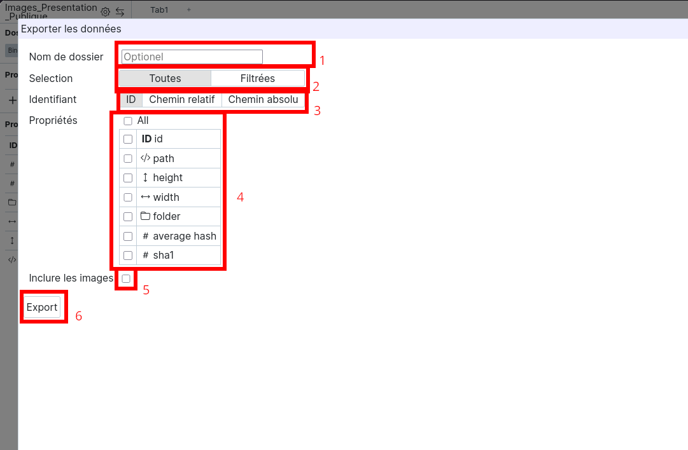

# Exporter des propriétés

Une fois vos annotations réalisées, vous pouvez décider d'exporter ces dernières, avec ou sans une reproduction des images.

Vous pourrez alors choisir si vous souhaitez exporter toutes les propriétés, ou seulement une partie d'entre elles. 

Afin de personaliser votre export vous pouve : (1) Choisir un nom pour le dossier d’export, si vous ne précisez rien, il sera nommé après la date et l’heure actuelle, au format AAAA − M M −DD −HH −M M −SS. (2) Sélectionner une sous-partie de vos images et données associées. (3) choisir entre “ID”, “Chemin relatif” et “Chemin absolu”. (4) Sélectionner les propriétés à exporter. (5) Inclure les images dans l’export.

Pour finir, appuyez sur le bouton “export” (6) pour valider vos choix et lancer l’export.

