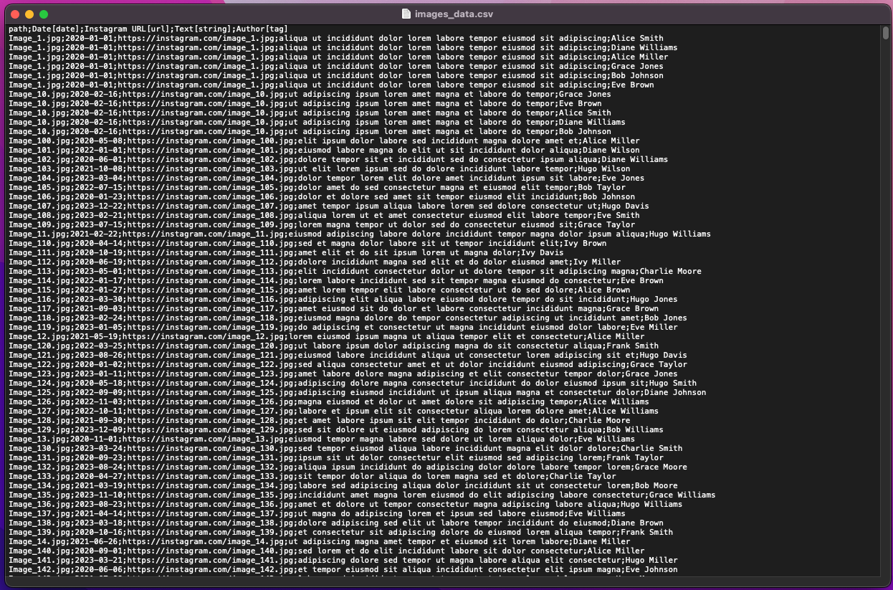
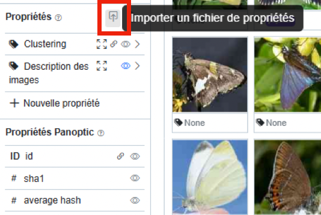
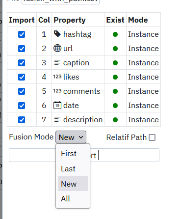

# Importer des propriétés

Panoptic étant pensé pour le travail avec des données plurisémiotiques, il est possible d’importer dans
l’interface du logiciel des PROPRIÉTÉS ASSOCIÉES AUX IMAGES. Les propriétés im-
portées dans Panoptic sont automatiquement structurées comme les propriétés que l’on peut créer soi-même. Elles peuvent donc être modifiées comme vous le souhaitez.

Panoptic permet l'exploration de corpus plurisémiotiques. Pour répondre à ce besoin méthodologique, Panoptic propose une série de fonctionnalités pour manipuler des images ET des données textuelles associées. Il est donc possible d'associer aux images importées un fichier de propriétés, en format .csv.

## Qu'est-ce qu'un fichier en format .csv ?
            
Un fichier avec l'extension .csv (pour "Comma-Separated Values", "valeurs séparées par des virgules" en français) est un format de fichier texte utilisé pour stocker des données tabulaires, comme celles que l'on trouve dans une feuille de calcul (Excel par exemple). Dans un fichier .csv, chaque ligne représente une ligne de données, et les valeurs de chaque colonne sont séparées par un point-virgule. Ce type de fichier se gère généralement dans une application d'édition de texte brut (bloc-note, textedit).

## Quels types de données peuvent être importées ?

| Nom | Explication |
|---|---|
| text |  Des données textuelles : lorem ipsum... |
| number | Des données numériques : 0123456789 |
| tag | du texte, qui sera présenté sous forme de tags dans l'interface de Panoptic |
| multi_tags | plusieurs blocs de texte, séparés par des virgules (,), qui seront présentés sous forme de tags dans l'interface de Panoptic |
| checkbox  |  une valeur *true* (case cochée) ou *false* (case non cochée) |
| url  |  un lien vers un site web |
| date | une date |
| color | Des couleurs, dans la liste suivante : red, pink, grape, violet, indigo, blue, cyan, teal, green, lime, yellow, orange |

## Comment formater correctement ces données ?

Le fichier .csv contenant les données associées aux images doit être structuré de la manière suivante :
- Toutes les données doivent être séparées par des points-virgules ( ; ).
- La première ligne du .csv doit contenir les entêtes. La partie entre crochets correspond au type de la propriété (cf. page précédente). La partie en dehors des crochets correspond au nom que vous souhaitez donner à la propriété.
    - Cette première ligne doit être écrite de la manière suivante : path;date de création[date];lien vers l’image[url];code couleur 1[color];code couleur 2[color];
    - Important : la toute première donnée a un format différent ("path") : il s’agit du chemin (relatif ou complet) vers l’endroit où est située l’image sur votre ordinateur : C:/mon/dossier/personnelle/image1.jpg. Pour le reste, vous pouvez ordonner les métadonnées comme vous le souhaitez.
- Les lignes suivantes contiennent les métadonnées de chaque image, remplies en fonction du type de
propriétés : C:/mon/dossier/personnel/image1.jpg;24/10/2024;https://instagram.com/image.png;blue;red

**Spécificités pour le formatage :**

- Plusieurs possibilités pour l’horodatage : 2024 ; 02/2024 ; 19/02/2024 ; 19/02/2024 12:45 ; 19/02/2024 12:45:55 ; 19-02-2024T12:45:55.000Z ; 2024/02/19 12:45:55.
- Pour l’import des multi_tags, les différents tags inscrits doivent être séparés par une virgule ( , ).

## Exemple d'un fichier .csv bien formaté pour Panoptic

## Comment importer les données bien formatées dans Panoptic ?

Quand votre fichier à importer est bien structuré, rendez-vous dans votre projet Panoptic et, à droite de la section "Propriétés", cliquez sur l’icône d’import de propriétés. Dans la fenêtre qui s’ouvre, choisissez le fichier .csv à importer. Panoptic ouvre alors le fichier, et en indique une synthèse dans un tableau à cinq colonnes. Vous pouvez agir sur la première et la dernière :
- Cocher ou décocher les propriétés à importer (de base toutes les
propriétés du tableau .csv seront importées).
- Indique le numéro de colonne dans le .csv d’origine.
- Indique le nom des propriétés et leur type sous forme de logo.
- Indique si la propriété existe déjà dans Panoptic ou non.
- Changer le mode de la propriété dans panoptic : "instance" ou "image".

Précisez en cochant ou non la case "Relative Path" si le chemin des images indiqué dans le fichier .csv est relatif ou absolu.

Vous pouvez ensuite valider l’import en cliquant sur "Import". Les données s’importent dans la section "propriétés" de Panoptic et sont en donc manipulables désormais.

## Précision sur le mode de fusion des données

Si l’on cherche à importer des propriétés déjà existantes (typiquement, si deux personnes travaillent chacune de leur côté sur un même corpus d’images et l’annotent avant de se partager leurs annotations pour mettre à jour leurs avancées respectives), il y a la possibilité de choisir le mode de fusion des données. Quatre possibilités sont proposées :
- New : ce mode crée une nouvelle instance de l’image renseignée dans la colonne path (n’écrase donc pas les données existantes)
- First : ce mode écrase les propriétés de la plus ancienne instance d’une image enregistrée dans Panoptic, et les remplace par celles renseignées dans le fichier .csv en cours d’import.
- Last : ce mode écrase les propriétés de la plus récente instance d’une image enregistrée dans Panoptic, et les remplace par celles renseignées dans le fichier .csv en cours d’import.
- All : ce mode écrase toutes les propriétés correspondant aux différentes instances d’uneimage pour les remplacer par les propriétés renseignées dans le fichier .csv importé. 