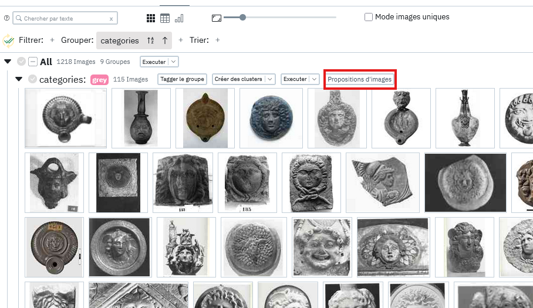

# Les recommandations

Un troisième outil de similarité sont les recommandations pour compléter un groupe existant. 

Il faut préalablement avoir groupé ses images par une propriété de type tags ou multi_tags et cliquer sur le bouton "Proposition d'images":

Cela ouvre alors une liste de propositions d'images similaires à toutes les images du groupe source, on peut venir ensuite pour chaque image soit valider ou refuser. En validant une image cela va venir l'ajouter au groupe en lui assignant le tag du groupe.